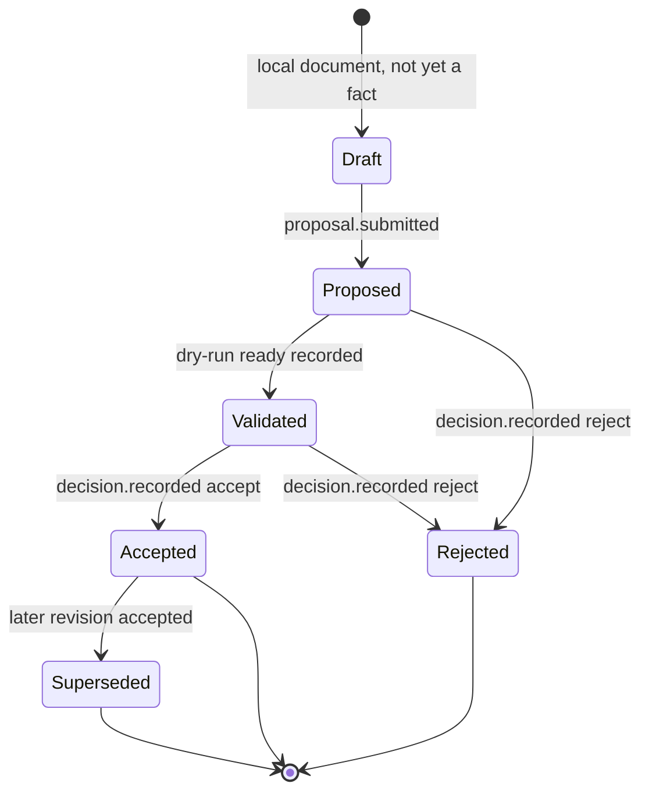

# ADR-0038: Charter v0.1 Errata After the M0 Kernel Proof

- Status: Accepted
- Date: 2026-09-03

This record does not reopen ADR-0034 or ADR-0037. It registers, in one place, the
places where charter v0.1 and chapter 18 no longer match the code that closed M0,
fixes the ordering and acceptance gap in the M1 milestone, and sets two governance
rules (errata method, ADR granularity) so later milestones do not repeat the drift.

## Context

An independent re-audit of `main` at `ae1ed3a` re-ran every check listed in
ADR-0037 §Validation and confirmed the kernel proof is closed inside the ADR-0034
scope. The same audit compared the 2026-08-21 text of charter §14.2 with what was
delivered and found four items that are partial or reinterpreted rather than
complete, and several clauses elsewhere in the charter that the implementation has
already diverged from:

- §8.1 lists `Proposal`, `Dissent`, `Decision`, `Run` and `Artifact` as ResearchSpec
  entities, but `Run` is implemented as an event-sourced aggregate (ADR-0024) and the
  other four have no schema at all.
- §13.1 draws one state diagram for both revision states and run states; ADR-0024
  already split the run side and left the revision side unowned.
- §14.2 “确定性提案/审批样例” was delivered as the plan-authorization gate plus the
  T0 `simulate` grant. That is capability authorization, not a `Proposal` object.
- §14.2 “CLI 停止” was delivered as a cancellation-request fact with no consumer.
- Chapter 18 marks decision `6-DBC` (events + rebuildable projections + artifact
  index) as “M0 生效”, while ADR-0037 explicitly excludes projections and the index.
- §14.3 lists seven M1 items with no order, no acceptance sentence, no mapping to
  threat-model gates and no budget figure. M0 had the §19 checkpoint sentence; M1
  has no counterpart.
- Chapter 18 decision `7-PLD` places model-provider adapters in tier T2 (separate
  subprocess) and says M1 implements T0–T2; §14.3 never mentions isolation.
- §9.4 capability names are examples; `authorize_plan` matches arbitrary identifiers.
- §14.5 criterion 4 pulls an editable canvas into the first public MVP.
- §17 still shows ADR-0002 as accepted although the ADR index marks it superseded by
  ADR-0013; chapter 18 §2.2 asks for a Python 3.14 forward-compatibility job that CI
  does not have.
- §14.2 already carries two inline erratum blocks. Each milestone closure would add
  another.
- Four M0 ADRs (0027, 0028, 0029, 0031) each record one CLI command. Thirty-seven
  ADRs now describe zero executed experiments.
- ADR-0011 deferred contribution mechanics; the repository is public and has no
  CONTRIBUTING, DCO or templates.

The researcher reviewed these findings on 2026-09-03 and accepted all of them.

## Decision

The following errata are accepted. Charter §23 reproduces them as a table; original
charter text is retained as history and only receives one-line pointers.

### E1 — §8.1 entity table is split

`ResearchSpec` declares intent: `ResearchQuestion`, `Hypothesis`, `Prediction`,
`EvidenceRecord`, `DatasetSpec`, `ModelSpec`, `WorkflowSpec`, `ResourceSpec`,
`EvaluationSpec`, `PolicySpec`. `Proposal`, `Dissent`, `Decision`, `Run` and
`Artifact` are event-sourced aggregates: they exist as ResearchEvent facts and
rebuildable projections, never as spec fields. This follows P8 and ADR-0007 and
matches how `Run` is already implemented.

### E2 — §13.1 becomes two state machines

Run/Attempt lifecycle is ADR-0024 and is unchanged. The revision lifecycle is
separate and provisional until M1-1 freezes it:

`Accepted` is a `Decision` fact about an immutable revision, not a mutable field on
the revision. A Run references the accepted revision’s `specDigest`; it does not
change revision state.

### E3 — §14.2 debts are registered

| §14.2 item | Delivered as | Registered as |
|---|---|---|
| 确定性提案/审批样例 | Plan-authorization gate + T0 `simulate` | Reinterpreted. `Proposal` / `Dissent` / `Decision` objects are M1-1. |
| CLI 停止 | `runs cancel` appends `*.cancel.requested`; SimulatedRuntime returns `unresolved` | Partial. M1-0 makes SimulatedRuntime consume the request and emit `attempt.cancelled` / `run.cancelled`. |
| 本地 SQLite 元数据存储 (`6-DBC`) | Event source only | Partial. Rebuildable projections, artifact index and a verified high-water cache for `RunControl` are M1-0 (ADR-0015 remainder). |
| 重试 / 取消路径测试 | Reducer and RunControl corpora | Partial at runtime level. Runtime-driven retry and cancel outcomes arrive with M1-0. |

Each row is tracked by a GitHub issue with a fixed title so later slices can cite it:

- `[M1-0] SQLite 可重建投影、制品索引与 RunControl 已校验高水位缓存（ADR-0015 剩余，6-DBC）`
- `[M1-0] SimulatedRuntime 消费取消请求并产出 attempt.cancelled / run.cancelled（闭合“CLI 停止”）`
- `[M1-1] Proposal / Dissent / Decision 事件对象（§14.2 提案样例重新解释）`

The M1 order in E4 is tracked by `[M1] 研究助手闭环：切片顺序、安全门与检查点（ADR-0038 E4）`.
None of them reopen ADR-0037.

### E4 — §14.3 M1 receives order, gates, checkpoint and budget

Order is set by the living threat model, not by the list order in §14.3:

| Slice | Deliverable | Gate / dependency |
|---|---|---|
| M1-0 | Debts in E3; typed `SecretRef` and redaction policy; `ResearchEvent` actor `kind` (`human` / `ai` / `system` / `policy`) and model identity | TM-007 blocks any external API; Θ(N²) rebuild blocks M1 event volume |
| M1-1 | `proposal.submitted`, `dissent.recorded`, `decision.recorded` payload schemas; proposal carries semantic-diff digest, predictions, falsification conditions, risk; `decisionId` joins existing `run.reviewed`; `proposals` / `decisions` CLI | ADR-0005 corpus test: a stored dissent survives a later decision |
| M1-2 | Minimal `ModelProvider` (decision `8-MC`); `DeterministicMockProvider` from fixtures; `ai.call.*` events store prompt/output digests and artifact refs, never inline text; declared / measured / allowed capabilities | Zero network; realises ADR-0017 |
| M1-3 | Local Markdown / PDF text import → `EvidenceRecord` + artifact CAS + `evidence.imported`; default `LicenseRef-Unknown`, uses per `14-RB`; citation `{evidenceId, snapshotDigest, span}` | TM-006 adversarial corpus with the mock provider: evidence text cannot change capability or tool behaviour |
| M1-4 | OpenAI-compatible HTTP adapter; default endpoint is a local MLX-LM / llama.cpp server; remote endpoints require `SecretRef` + `read.external_api` + a budget cap; `budget.reserved` / `consumed` / `exceeded` are the first runtime-enforced caps | `12-SECB` gate 2; E5 |
| M1-5 | Seeded synthetic `training.step` / `evaluation.metric` from SimulatedRuntime; `researchos report RUN` static HTML/Markdown with research, training, cost and lineage sections, every summary linked to an `eventId` | Satisfies §14.3 “可视化报告”; React Flow deferred, `9-UIA` direction unchanged |
| M1-6 | Issue #19 remainder: a locally authenticated durable authorization fact consumed by SimulatedRuntime by `{eventId, sequence}`; M1 closure ADR with an explicit not-delivered list | Charter §14.3 |

M1 checkpoint sentence, the counterpart of §19 for M0:

> 一条命令：ResearchSpec → Mock 提案（含预测与可证伪条件）→ 反方异议 → 研究者决定（异议保留）
> → 模拟运行 → 带 eventId 链接的报告。全程 ¥0、无外网、每一步都是事实源里可回放的事件。

Budget: M1 defaults to ¥0 by pointing the OpenAI-compatible adapter at a local
model server. At most one remote API smoke test ≤ ¥30 may be run, and only after a
single explicit approval under §15.3. The ¥1000 envelope remains reserved for M2.

The first M1 pull request should be the demonstrable command chain (M1-0 + M1-1 +
M1-2 together), with protocol documents following it, so the milestone has a
visible receipt before it has a protocol library.

### E5 — Built-in adapters run in-process during M1

Decision `7-PLD` assigns model-provider adapters to tier T2. For M1 the built-in
mock and OpenAI-compatible adapters are core-maintained code and run in-process as
T0/T1. The T2 subprocess boundary (JSON-RPC over stdio, temporary directory,
limited network, explicit secret scope) is implemented before the first community
adapter is accepted, not before. ADR-0016, when written, carries the full tiering
and must not widen this.

### E6 — Capabilities get a closed registry

`authorize_plan` keeps exact matching, but M1 adds a trusted-kernel capability
registry so that matching is against a known vocabulary. Initial members: `simulate`,
`read.local_evidence`, `read.external_api`, `write.experiment_draft`. Unknown names
fail closed, as today.

### E7 — §14.5 criterion 4 relaxed for the first public MVP

“用户可在图形、YAML或Python中检查同一实验定义” is satisfied for the first public MVP by
YAML, the Python SDK and the static report. The editable canvas moves after M2. The
single-source rule of §4.3 is unchanged.

### E8 — Errata method

Charter corrections are collected in a single §23 errata table keyed E1, E2, ….
Affected clauses receive one pointer line, not a new inline block. The two existing
§14.2 blocks stay as history. After M1 closure the charter is consolidated into v0.2
and v0.1 is frozen.

### E9 — Stale rows

§17: ADR-0002 is superseded by ADR-0013. §18 decision 2: CI adds a Python 3.14
forward-compatibility job that is allowed to fail; 3.12 and 3.13 remain required.

### E10 — ADR granularity

An ADR records a constraint or a trade-off. A new command, report or CLI surface is
documented by a protocol document and a guide, not by its own ADR. Existing
per-command ADRs remain valid history. M1 is expected to need three to four ADRs.

### E11 — Contribution mechanics (ADR-0011 follow-up)

`CONTRIBUTING.md`, a pull-request template and issue templates are added. External
contributions (pull requests from forks) must carry a Developer Certificate of Origin
1.1 sign-off on every commit; CI enforces this only for fork pull requests. No CLA is
introduced. Authorship stays with the human contributor’s own identity.

## Consequences

- Charter §23 exists and is the only place new errata are added.
- README says M0 is closed and points to the M1 order and checkpoint in this record.
- CI gains a non-blocking 3.14 job and a DCO check for fork pull requests.
- M1 work starts from the E3 issues and the E4 order; a slice that skips a listed
  gate needs its own ADR explaining why.
- Nothing in this record delivers M1 code or reopens ADR-0037.

## Validation

1. `docs/charter-v0.1.md` contains §23 with rows E1–E11 and one-line pointers at
   §0, §8.1, §13.1, §14.2, §14.3, §14.5, §17 and §18.
2. `.github/workflows/ci.yml` has a `3.14` matrix entry with `continue-on-error`
   and a `dco` job gated on `github.event.pull_request.head.repo.fork`.
3. `CONTRIBUTING.md`, `.github/PULL_REQUEST_TEMPLATE.md` and
   `.github/ISSUE_TEMPLATE/` exist.
4. Four open GitHub issues carry the titles fixed in E3.
5. ruff, mypy, pytest, `researchos schema --check-all` and `uv build` still pass.

## References

- [Project charter v0.1](../charter-v0.1.md)
- [Chapter 18 decision guide v0.1](../chapter-18-decision-guide-v0.1.md)
- [ADR-0005 Researcher Final Decision](0005-researcher-final-decision.md)
- [ADR-0007 Append-only Facts](0007-append-only-facts-rebuildable-projections.md)
- [ADR-0011 Apache-2.0 License](0011-apache-2-license.md)
- [ADR-0015 SQLite Event Source](0015-sqlite-event-source-projections-and-artifacts.md)
- [ADR-0024 Run and Attempt State Machine](0024-run-attempt-state-machine.md)
- [ADR-0034 M0 Scope Clarification](0034-m0-scope-clarification.md)
- [ADR-0037 M0 Kernel-Proof Closure](0037-m0-kernel-proof-closure.md)
- [Issue #19](https://github.com/victorzhong0110/llm-research-os/issues/19)
- [Living threat model](../security/threat-model.md)
- [Developer Certificate of Origin 1.1](https://developercertificate.org/)
