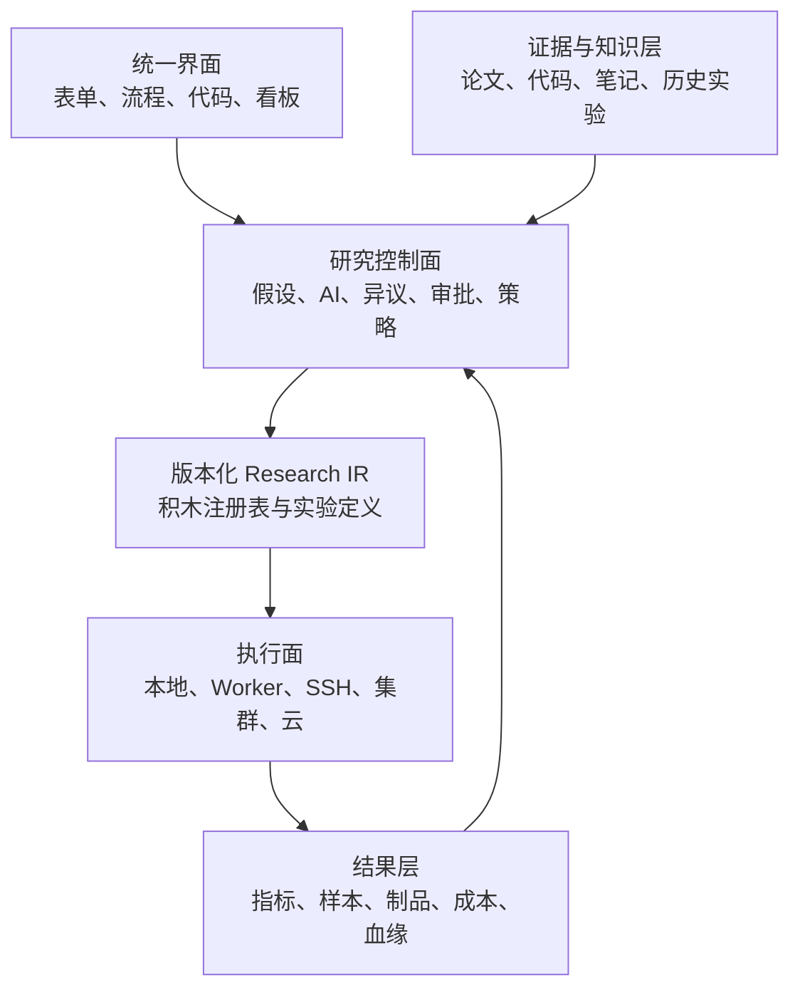
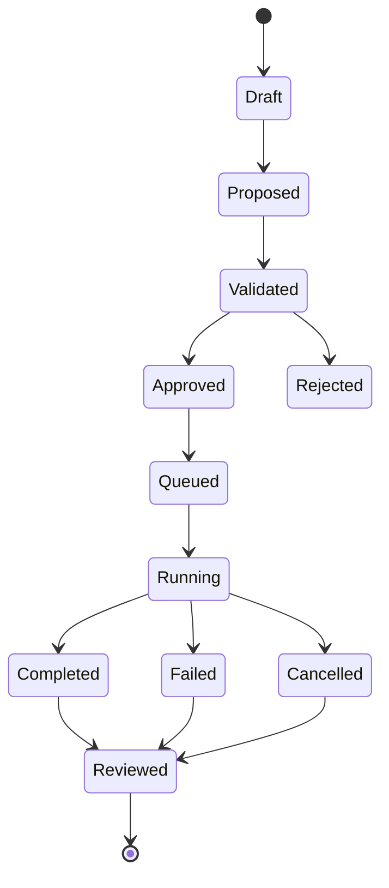

# LLM 研究操作系统：项目宪章与最小内核规格 v0.1

> 状态：已接受基线（Accepted Baseline）
>
> 日期：2026-08-21
>
> 接受日期：2026-08-21
>
> 临时名称：LLM Research OS（下文简称“本项目”）
>
> 目的：在写代码之前，固定项目边界、核心语义、首个闭环和验收方法。
> 注意：本文件是当前开发基线；改变已决定事项必须写入 ADR。标为“暂定”或“待验证”的内容，其默认方向和验证方法已被接受，但经验性细节仍须在相应里程碑验证，不得表述为已经验证的事实。

---

## 0. 五分钟摘要

本项目不是新的训练框架，也不是 NeMo、ms-swift 或某家云平台的图形外壳。它是一个独立、开源、模型无关、训练后端无关、算力供应商无关的 **LLM 研究操作系统**。

它围绕完整研究闭环工作：

1. 研究者提出假设或开放问题；
2. AI与研究者收集论文、代码、笔记和历史实验；
3. AI提出训练数据、模型结构、训练流程或全新框架方案；
4. 反方AI与确定性检查器主动寻找问题；
5. 研究者默认拥有最终决定权；
6. 系统在本地、任意远程机器或云GPU执行实验；
7. 系统记录训练、评测、系统、成本、血缘和AI决策；
8. 人类与AI共同解释结果、分叉实验并形成可复用知识。

项目第一目标用户是：**理解自己的研究问题、会少量或中等程度 Python，但不熟悉大模型训练基础设施的个人研究者或小型实验室**。长期目标是通过渐进式界面服务新手和专家。

首版只证明一条小而完整的闭环，不尝试一次实现所有云、训练框架和可视化能力。

---

## 1. 状态词

本文使用以下状态：

| 状态 | 含义 |
|---|---|
| 已决定 | 已形成当前约束；改变时必须写架构决策记录（ADR） |
| 暂定 | 当前推荐方案；实施前仍需原型或比较 |
| 待验证 | 需要调查、实验或用户测试 |
| 非目标 | 明确不在当前阶段实现 |

---

## 2. 愿景与使命

### 2.1 愿景（已决定）

让个人研究者和小型团队也能拥有一种可审查、可扩展、可复现的 LLM 研究工作方式，并允许AI参与从资料调查到实验反思的全过程，而不把研究者锁定在某个模型、训练框架、云厂商或Agent产品中。

### 2.2 使命（已决定）

本项目提供五种基础能力：

1. **研究语义**：明确表示假设、证据、预测、实验、异议、结论和决策。
2. **可组合实验**：用默认积木、自定义积木、代码和容器描述训练与研究流程。
3. **AI研究协作**：允许任意API模型或本地模型提出、修改、反驳和执行研究方案。
4. **任意算力执行**：通过统一Worker协议连接本地设备、已有服务器、集群和云GPU。
5. **完整可观测性**：统一呈现训练、评测、系统、成本、血缘、样本和AI决策。

### 2.3 核心口号（暂定）

> Every experiment is inspectable. Every decision is traceable. Every backend is replaceable.

中文含义：每个实验可审查，每项决策可追溯，每个后端可替换。

---

## 3. 项目边界

### 3.1 本项目是什么（已决定）

- 一个独立项目，拥有自己的研究领域模型、协议和插件SDK；
- 一个研究控制面，而不是某个训练框架的附属组件；
- 一个能编排现有框架，也允许研究者从零编写新框架的系统；
- 一个让AI提出变更、解释依据并在授权范围内执行的研究环境；
- 一个本地优先、以后可扩展至团队和大规模集群的系统。

### 3.2 本项目不是什么（已决定）

- 不自行重写所有分布式训练基础设施；
- 不承诺“一键训练任意规模基础模型”；
- 不把下降的loss等同于研究成功；
- 不把arXiv、GitHub或任何单一来源自动标记为可信；
- 不保证任意代码都能转换成可视化积木；
- 不声称任意插件代码天然安全；
- 不保证不同硬件和非确定性算子产生逐比特相同结果；
- 不以AI替代研究者的科学判断；
- 首版不支持所有云厂商、训练框架和加速器。

### 3.3 独立性原则（已决定）

- 核心包不得依赖 NeMo、ms-swift、DeepSeek Harness、Argo、SkyPilot、MLflow 或特定云SDK才能启动。
- 外部项目通过适配器接入。
- 对上游项目有通用价值的改动可以提交PR，但本项目不依赖上游接受PR才能保持基本功能。
- 适配器可以单独发布、单独失效和单独升级。
- 核心规范采用语言中立格式；Python只是首个参考实现。

---

## 4. 目标用户与交互层级

### 4.1 第一目标用户（已决定）

懂研究问题、能阅读或修改Python，但不具备成熟大模型训练基础设施的个人研究者或小型实验室。

### 4.2 长期用户（已决定）

- 第一次训练模型的新手；
- 领域研究者；
- LLM训练工程师；
- 分布式系统与CUDA/Triton研究者；
- 多人实验室和开源社区。

### 4.3 渐进式界面（已决定）

同一个版本化研究定义应逐步提供以下视图：

1. 引导式表单；
2. 可视化流程图；
3. YAML/JSON；
4. Python SDK；
5. 自定义代码与容器；
6. 运行和研究看板。

不同视图必须引用同一个规范对象，不能各自维护互相漂移的配置。

---

## 5. 宪法级原则

以下原则高于具体框架与实现：

### P1. 研究者拥有默认最终决定权（已决定）

AI必须能够反对研究者，但默认不能替代研究者作最终科学判断。研究者可以覆盖AI建议；AI异议仍作为记录保留。

### P2. AI变更必须显式（已决定）

AI不得在不可见状态下修改实验。任何影响数据、代码、训练、预算或结论的行为都必须对应一个可追踪的提案、批准或策略授权。

### P3. 权限由外部策略执行（已决定）

不得依赖模型“自觉”控制费用、密钥、删除和网络访问。即使进入未来L4/L5模式，AI也只能在可撤销的能力与预算边界内行动。

### P4. 证据不等于权威（已决定）

来源、复现记录、版本和适用条件必须与主张一起保存。平台不得用简单的“可信/不可信”二元标签代替研究判断。

### P5. 可重建优先于虚假确定性（已决定）

系统追求重建实验定义、环境、输入和决策链，而不承诺在所有硬件上逐比特重现结果。无法确认的状态必须明确表示为 unknown，而不是猜测成功。

### P6. 核心最小，能力可扩展（已决定）

大多数能力可以作为插件替换，但身份、版本、事件、权限、状态转换和完整性检查属于最小可信内核，插件不能绕过。

### P7. 自定义代码是一等公民（已决定）

研究者可以脱离现有训练框架，自行实现模型、训练循环、并行方式、算子、运行时或其他尚未预见的研究方法。

### P8. 原始事件先于看板（已决定）

看板是事件和制品的投影，不是事实来源。必须先保存结构化原始数据，再决定如何展示。

### P9. 本地优先但不本地锁定（已决定）

项目应能在单台开发机上启动；同一协议随后可以连接远程机器和集群。

### P10. 研究自由不等于平台无边界（已决定）

研究者可以运行平台认为“可能没有意义”的实验，但格式错误、超出明确预算、越权访问或违反管理员策略的操作必须被阻止或重新授权。

---

## 6. 概念架构



### 6.1 六个逻辑层（已决定）

| 层 | 主要职责 | 首版是否自行实现 |
|---|---|---:|
| 研究控制面 | 假设、计划、AI提案、异议、审批、决策 | 是 |
| 规范与插件 | Research IR、积木清单、能力协商 | 是 |
| 证据与知识 | 获取、快照、索引、引用、适用性记录 | 最小实现 |
| 执行 | 本地/远程任务、租约、停止、恢复 | 是 |
| 观测与制品 | 事件、指标、日志、模型、数据和血缘 | 是，复用存储组件 |
| 交互 | CLI、API、Web、DAG、看板 | 逐步实现 |

### 6.2 模块化单体（已决定）

首版采用模块化单体，而非微服务：

- 一个本地控制进程；
- 一个数据库；
- 一个制品目录；
- 零个或多个Worker；
- 明确的内部模块边界；
- 后续可在不改变协议语义的情况下拆分服务。

---

## 7. 最小可信内核

内核只负责不能交给普通插件的约束。

### 7.1 内核职责（已决定）

1. 对象身份、版本和引用完整性；
2. `ResearchSpec`验证和修订管理；
3. 事件追加、关联和读取；
4. 权限、预算和审批策略执行；
5. 积木注册、类型检查和能力协商；
6. 任务状态机、租约和幂等性；
7. 制品摘要、来源和生命周期；
8. 秘密信息的引用与脱敏；
9. 迁移与协议版本兼容。

### 7.2 可替换能力（已决定）

- LLM提供商和本地模型；
- 训练框架；
- 评测器；
- 数据处理器；
- Worker运行时；
- 调度器和云供应器；
- 数据库和对象存储实现；
- 指标导出器；
- Web界面与Agent前端。

---

## 8. 四个首要核心协议

### 8.1 `ResearchSpec`

#### 目的

以版本化、可比较、可审查的方式描述“为什么做、做什么、如何做、如何判断”。

#### 最小字段（暂定）

```yaml
apiVersion: researchos.dev/v0alpha1
kind: ResearchProject
metadata:
  id: project-id
  revision: 1
  title: Example project

hypotheses: []
evidence: []
datasets: []
models: []
workflows: []
evaluations: []
resources: {}
policies: {}
```

#### 核心实体（已决定）

| 实体 | 作用 |
|---|---|
| `ResearchQuestion` | 可以尚无明确预测的开放问题 |
| `Hypothesis` | 可被证据支持或反驳的假设 |
| `Prediction` | 实验前记录的预期结果 |
| `EvidenceRecord` | 来源、快照、主张、适用条件和复现状态 |
| `DatasetSpec` | 数据来源、处理、版本、许可证和切分 |
| `ModelSpec` | 模型结构、初始化和可替换组件 |
| `WorkflowSpec` | 数据流、控制流、训练、评测与分析 |
| `ResourceSpec` | 硬件需求、预算、时间和位置约束 |
| `EvaluationSpec` | 指标、样本、基线、消融和停止标准 |
| `PolicySpec` | AI、用户、插件和Worker权限 |
| `Proposal` | 人类或AI提出的结构化变更 |
| `Dissent` | 针对方案或结论的异议 |
| `Decision` | 接受、拒绝、修改或继续的决定 |
| `Run` | 某一不可变实验修订的执行实例 |
| `Artifact` | 数据、模型、日志、图表、报告或代码 |

#### 不可变性（已决定）

- 草稿可以修改；
- 一旦Run开始，所引用的实验修订不可原地修改；
- 任何改变必须产生新修订、分支或新Run；
- 修订之间必须能够生成语义差异，而不只是文本差异。

#### 规范载体（暂定）

- YAML/JSON作为用户可读表示；
- JSON Schema作为语言中立验证契约；
- Pydantic作为首个Python参考实现；
- 未来可以生成OpenAPI、TypeScript类型和UI表单。

### 8.2 `BlockManifest`

#### 目的

让默认框架、自定义代码和外部服务能够以统一方式参与研究流程。

#### 最小字段（暂定）

```yaml
apiVersion: researchos.dev/v0alpha1
kind: Block
metadata:
  id: example.train
  version: 0.1.0

runtime:
  type: python        # python | container | remote-service | composite | simulated
  entrypoint: package.module:function

inputs: []
outputs: []
configSchema: {}
resources: {}
capabilities: []
permissions: []
telemetry: []
reproducibility: {}
```

#### 积木类型（已决定）

- 默认积木；
- 组合积木/子流程；
- 自定义Python积木；
- 自定义C++、CUDA或Triton构建积木；
- OCI容器积木；
- 外部API/服务积木；
- 人工审核积木；
- AI决策或批判积木；
- 模拟积木。

#### 可视化边界（已决定）

平台可以理解积木声明的端口、参数、资源和事件，但不承诺理解任意代码内部语义。任意代码在图上可以是“输入输出透明、内部实现不透明”的节点。

#### 图语义（已决定）

`WorkflowSpec`不能被限制为纯DAG。它至少需要表示：

- 普通数据依赖；
- 条件分支；
- 有界或策略控制的循环；
- 人工审批暂停；
- Agent循环；
- 并行、重试和超时；
- 动态产生的子实验；
- 嵌套子流程。

执行器可以把部分流程编译为DAG，但规范层不能因此丢失研究循环。

### 8.3 `ResearchEvent`

#### 目的

形成训练系统、AI和人类共同使用的事实流，使恢复、审计、比较和看板建立在同一来源上。

#### 最小字段（暂定）

```yaml
schemaVersion: v0alpha1
eventId: uuid
timestamp: rfc3339
type: run.started
actor: {}
projectId: project-id
experimentRevision: 3
runId: run-id
blockId: optional-block-id
correlationId: optional-id
causationId: optional-event-id
payload: {}
evidenceRefs: []
```

#### 事件类别（暂定）

- 研究：假设、预测、证据、异议、决定；
- 计划：提案、差异、验证、批准；
- 执行：排队、租约、开始、心跳、重试、停止、结束；
- 训练：step、epoch、loss、梯度、学习率、checkpoint；
- 评测：指标、样本、错误分类、置信区间；
- 系统：GPU、显存、CPU、内存、网络、存储、吞吐；
- 成本：报价、预计费用、实际费用、预算告警；
- AI：可观察输入、输出、工具调用、提案和依据；
- 制品：创建、验证、上传、引用、归档和删除标记。

#### 追加式记录边界（已决定）

- 已发生事件不得被静默改写；
- 更正通过新事件表达；
- 敏感正文可以加密并存于可删除制品中，事件只保存引用和必要元数据；
- 删除请求通过tombstone和密钥销毁等方式兼顾审计与隐私；
- 系统记录模型可观察到的输入、输出与行动，但不要求模型提供隐藏思维链。

### 8.4 `WorkerProtocol`

#### 目的

让任何满足最低契约的本地或远程计算机成为执行节点，而不要求核心认识其云厂商。

#### 协议阶段（暂定）

1. Worker注册并上报能力；
2. 定期心跳和健康状态；
3. 获取或接收有期限的任务租约；
4. 拉取代码、配置和输入制品；
5. 准备原生或容器环境；
6. 执行、暂停、取消或恢复任务；
7. 流式发送事件、指标和日志；
8. 上传checkpoint和输出制品；
9. 完成、失败或丢失租约；
10. 控制面决定重试、恢复或人工介入。

#### Worker能力描述（已决定）

- 操作系统与CPU架构；
- 加速器厂商、型号、数量、显存和能力；
- 驱动与运行时；
- 节点内互联与节点间网络；
- 本地与共享存储；
- 支持的运行方式；
- 可用端口、网络出口和数据区域；
- 当前负载和租约；
- 可报告的遥测能力。

#### 初始运行时（已决定）

| 运行时 | 用途 |
|---|---|
| `SimulatedRuntime` | 无GPU测试调度、失败、恢复和指标 |
| `NativeProcessRuntime` | Apple MPS、自定义本地代码和非容器工作负载 |
| `OCIContainerRuntime` | Linux/CUDA环境和可移植训练任务 |

#### 安全基线（暂定）

- Worker优先主动向控制面建立加密连接，以适应NAT和自建机器；
- 每个任务使用短期、最小权限凭据；
- 密钥只在运行时注入，不写入ResearchSpec、日志或镜像；
- 任务清单和制品使用摘要验证；
- 网络、文件系统、设备和子进程权限由策略声明；
- 未信任积木默认进入隔离环境；
- 本地开发模式可以放宽限制，但必须清晰提示。

传输协议（HTTP、WebSocket、gRPC等）尚未决定；语义协议应与传输实现分离。

---

## 9. AI研究助手

### 9.1 模型中立（已决定）

平台必须支持：

- 商业或开源模型API；
- OpenAI兼容API；
- 非OpenAI兼容的专有API适配器；
- 本地加载模型；
- 不支持原生工具调用的小模型；
- 多模型协作。

提供商适配器应报告结构化输出、工具调用、上下文长度、流式输出、成本信息等能力。工作流根据能力降级，而不是假设所有模型相同。

### 9.2 AI行为对象（已决定）

AI的关键输出不是自由文本，而是以下可审查对象：

- `Proposal`：建议修改什么；
- `Rationale`：为什么；
- `EvidenceLink`：依据是什么；
- `Prediction`：预计观察到什么；
- `FalsificationCondition`：什么结果会推翻方案；
- `RiskAssessment`：数据、方法、安全和成本风险；
- `Dissent`：反方观点；
- `ActionRequest`：希望执行什么工具或任务；
- `ConclusionDraft`：对结果的暂定解释。

自由文本解释可以附加，但不能替代结构化对象。

### 9.3 反谄媚机制（已决定）

每个重要或高成本实验默认包含：

1. 方案提出者；
2. 独立反方评审；
3. 确定性验证器；
4. 人类或策略审批；
5. 结果后审查。

反方必须检查：

- 可证伪性；
- 替代解释；
- 数据泄漏与污染；
- 基线与消融；
- 指标是否回答研究问题；
- 预计收益是否值得成本；
- 失败结果是否仍有研究价值。

反方可使用另一模型，也可在资源不足时使用同一模型的独立上下文。格式、预算、数据重叠等机械检查不得仅依赖LLM。

### 9.4 自主性模型（已决定）

L1至L5只作为UI预设。真正的权限由能力集合、预算和审批规则表达，例如：

- `read.public_web`
- `read.private_notes`
- `write.experiment_draft`
- `write.code_branch`
- `execute.local`
- `execute.remote`
- `provision.gpu`
- `terminate.run`
- `delete.artifact`
- `publish.external`

每项能力可以附带次数、金额、时长、GPU数、数据范围、目标域名、密钥范围和审批条件。

“全权交给AI”表示在该策略边界内自动批准，不表示获得未授权的系统、密钥或无限预算。

---

## 10. 证据、笔记与知识层

### 10.1 三种不同用途（已决定）

必须区分：

1. AI读取资料以辅助研究设计；
2. 将资料整理成可复用Skill或操作指南；
3. 将资料内容实际放入模型训练数据。

第三种用途需要单独的许可证、隐私、质量和污染审查，不能因资料可公开访问就自动允许。

### 10.2 `EvidenceRecord`（暂定）

至少保存：

- 原始URI；
- 获取时间；
- 内容快照或内容哈希；
- 论文版本、Git commit或发布版本；
- 作者和许可证；
- 提取出的具体主张；
- 支持和反对该主张的其他证据；
- 适用模型、数据、软件、硬件和规模；
- 是否复现、由谁复现、复现结果；
- 它影响了哪项提案、实验或决定。

### 10.3 初始连接器（暂定）

- 本地Markdown/PDF；
- Git仓库；
- GitHub API；
- arXiv API；
- 历史ResearchSpec与实验制品；
- 通用网页抓取；
- MCP资源和工具。

### 10.4 不可信内容边界（已决定）

- 网页、论文、README、Issue和笔记默认是数据，不是系统指令；
- 外部内容不能自行扩大权限或触发工具；
- 引用必须可回到原始片段或快照；
- 由资料生成的代码在运行前接受静态检查、权限检查和隔离；
- 资料的“可信度”由多维证据表达，不使用单一布尔值。

---

## 11. 训练与外部生态的关系

### 11.1 训练后端（已决定）

| 项目/类型 | 在本项目中的位置 |
|---|---|
| 通用Python/PyTorch/JAX代码 | 一等自定义执行后端 |
| ms-swift | 易用训练适配器 |
| NVIDIA NeMo/Megatron | 大规模训练适配器 |
| LLaMA-Factory/Axolotl等 | 可选训练适配器 |
| 自研训练框架 | 自定义代码、容器或组合积木 |

### 11.2 Agent Harness（已决定）

DeepSeek Harness、Codex、Claude Code和其他Agent可以通过API、MCP或专用插件成为研究助手前端，但不拥有本项目的研究事实源。

本项目可吸收DeepSeek Harness的以下思想：

- 能力接口与提供者分离；
- 配置化组合；
- 追加式可重放轨迹；
- 运行模式/Profile；
- 工具、模型、Skill和UI可替换。

但本项目保留不可绕过的最小可信内核，不直接采纳“所有不变量均可被插件替换”。

### 11.3 编排与算力（暂定）

| 外部能力 | 可能用途 | 约束 |
|---|---|---|
| Argo/Kubeflow/Flyte | Kubernetes执行后端 | 不作为ResearchSpec本身 |
| Slurm | 实验室/HPC调度后端 | 通过执行适配器 |
| SkyPilot | 云供应与既有机器接入 | 可替换供应器 |
| SSH | 简单远程引导 | 不作为长期唯一协议 |
| 自有Worker | 任意机器统一入口 | 本项目核心协议 |

### 11.4 可观测性（已决定）

本项目拥有自己的研究事件和看板语义，同时允许导出到：

- MLflow：实验、参数、指标、模型和制品；
- OpenTelemetry：日志、指标、trace和profiles；
- OpenLineage：任务、运行和数据集血缘；
- Prometheus、TensorBoard、W&B等可选系统。

这些系统是导入/导出目标，不是本项目唯一事实源。

---

## 12. 看板与结果模型

### 12.1 六类首要视图（已决定）

| 视图 | 最低内容 |
|---|---|
| 研究 | 问题、假设、预测、证据、异议、决定、结论 |
| 训练 | loss、梯度、学习率、稳定性、checkpoint、异常 |
| 能力 | 基准、样本、错误类型、行为变化、置信区间 |
| 系统 | GPU、显存、CPU、内存、网络、存储、吞吐、故障 |
| 成本 | 报价、预计与实际金额、GPU时、token、存储和能耗 |
| 血缘 | 数据、代码、配置、模型、环境、资料和AI操作关系 |

### 12.2 比较原则（已决定）

- 每个实验必须能够选择一个或多个基线；
- 训练指标、质量指标和系统指标不得混为单一总分；
- 允许结论为“无显著差异”“证据不足”或“实验无法回答问题”；
- 结果页必须展示失败、停止和unknown状态；
- AI生成的总结必须链接到原始指标、样本或事件。

---

## 13. 状态与控制流

### 13.1 实验修订状态（暂定）



### 13.2 状态规则（已决定）

- `Validated`只说明机器可检查条件通过，不说明研究方案正确；
- `Approved`可以由人类或策略授权产生；
- 执行中的更改创建新修订，不修改当前Run；
- 失去Worker心跳不能立刻推断任务失败，应先进入不确定/失联状态；
- 重试生成新的attempt并保留原始失败事实；
- `Completed`不等于假设得到支持，必须经过`Reviewed`。

---

## 14. 首个可运行纵向闭环

### 14.1 场景（已决定）

研究者提出一个小模型训练假设，并提供一份资料。AI读取资料、形成提案和预测；反方指出风险；研究者批准；系统执行数据准备、训练、评测和比较；最后生成带证据链接的结论草案。

### 14.2 内部里程碑 M0：内核证明（已决定）

不得使用付费GPU。包含：

- `ResearchSpec v0alpha1`；
- `BlockManifest v0alpha1`；
- `ResearchEvent v0alpha1`；
- 本地SQLite事件/元数据存储；
- 本地文件制品存储；
- `SimulatedRuntime`；
- `NativeProcessRuntime`；
- CLI创建、验证、运行、停止、查看事件；
- 失败、重试、取消和unknown路径测试；
- 一个无需LLM的确定性提案/审批样例。

### 14.3 内部里程碑 M1：研究助手闭环（已决定）

- 一个OpenAI兼容模型适配器；
- 一个本地模型适配器或确定性Mock；
- 结构化Proposal、Dissent和Decision；
- 本地资料导入与引用；
- 基础训练/评测模拟数据；
- 最小Web页面或可视化报告；
- AI操作事件与预算策略。

### 14.4 内部里程碑 M2：真实远程GPU闭环（已决定）

- 远程Worker；
- `OCIContainerRuntime`；
- GPU能力上报；
- 通用Python训练积木；
- 一个真实训练框架适配器（ms-swift为当前首选，仍待验证）；
- checkpoint、停止、恢复和制品上传；
- 训练、评测、系统、成本和血缘看板；
- 首次付费任务必须有严格单次和总额上限。

### 14.5 首个公开MVP验收条件（暂定）

1. 新用户可以在Apple Silicon Mac或普通Linux电脑一条命令启动；
2. 无GPU也能运行完整模拟实验；
3. 用户可连接一台自己控制的远程GPU机器；
4. 用户可在图形、YAML或Python中检查同一实验定义；
5. AI提出的每项修改都有差异、证据、预测、风险和预算；
6. 研究者可以拒绝AI，AI异议仍保留；
7. 远程任务可停止，并能区分失败、失联和未知；
8. 结果页可追踪到数据、代码、配置、环境和资料；
9. 删除训练后端适配器后，核心和通用Python积木仍可工作；
10. 所有核心协议均有版本和自动化契约测试。

---

## 15. 当前启动环境与费用纪律

### 15.1 当前环境（已知）

- Apple Silicon MacBook Pro；
- 24GB统一内存；
- 1TB本地存储；
- 5TB网盘，可用于加密归档和冷存储；
- 可用外部预算上限：人民币1000元。

### 15.2 本地执行策略（已决定）

- 控制面、数据库、UI和模拟Worker均在Mac运行；
- 小型PyTorch任务可以使用原生MPS；
- Mac容器主要用于CPU与兼容性测试，不能假定拥有Apple GPU；
- CUDA和NCCL路径以后通过远程Linux Worker验证；
- 网盘不作为训练热路径或事务数据库。

### 15.3 费用规则（已决定）

- M0不使用付费GPU；
- M1原则上不使用或仅进行明确批准的极短验证；
- M2之前比较当时的真实云价格和网络条件；
- 每次任务具有预计费用、单次上限、时间上限和停止策略；
- 总预算不能因AI自主性提升而自动扩大；
- 任何充值、订阅和不可逆购买均由研究者批准。

---

## 16. 单人启动与协作方法

### 16.1 双轨开发（已决定）

开发主线不等待完整课程学习；学习材料从同一代码变更产生。

每个重要变更提供：

1. 五分钟摘要：目标、接口、风险、测试；
2. 三十分钟导读：结构、数据流和主要取舍；
3. 可选深入材料：逐文件解释、练习和背景知识。

只有公共协议、长期依赖、权限、安全、付费和不可逆操作需要研究者阻塞式批准。

### 16.2 贡献者友好原则（已决定）

- 一条命令启动开发环境；
- 无GPU测试路径；
- 小而清晰的模块和Issue；
- 插件模板与契约测试；
- 架构决策记录；
- 核心与适配器分离；
- 中英文文档可逐步建设；
- 贡献者无需理解整个系统即可实现一个积木或适配器。

### 16.3 暂不采用的组织方式（非目标）

- 一开始建立多仓库和复杂发布矩阵；
- 一开始拆成微服务；
- 为显得完整而创建大量空模块；
- 未有真实用户前设计复杂组织权限和商业计费；
- 在核心协议未稳定前承诺长期兼容所有内部API。

---

## 17. 初始架构决策记录

| ADR | 决策 | 状态 |
|---|---|---|
| ADR-0001 | 项目拥有独立Research IR，不附属于训练或Agent框架 | 接受 |
| ADR-0002 | Pydantic是M0编写入口；版本化JSON Schema是对外语言中立契约；TypeScript类型由其生成 | 接受 |
| ADR-0003 | 采用最小可信内核，而非所有不变量均插件化 | 接受 |
| ADR-0004 | 采用模块化单体启动 | 接受 |
| ADR-0005 | 研究者默认最终决定，AI必须能够提交异议 | 接受 |
| ADR-0006 | 自主性由能力、预算和审批规则表达 | 接受 |
| ADR-0007 | 事件为追加式事实源，看板是投影 | 接受 |
| ADR-0008 | 同时支持原生进程和OCI容器运行时 | 接受 |
| ADR-0009 | Worker语义协议独立于具体传输技术 | 接受 |
| ADR-0010 | ms-swift作为首个真实训练后端适配器的暂定首选 | 接受方向；M2验证 |

---

## 18. 决策基线（已接受）

研究者已通读并接受本章全部推荐基线。各选项的证据、替代方案和取舍见[《第18章决策指南 v0.1》](llm-research-os-chapter-18-decision-guide-v0.1.md)。“M1/M2验证”表示接受默认方向与验证门，不表示尚未运行的实验已经得出结论。

| # | 决策码 | 已接受基线 | 状态与验证门 |
|---:|---|---|---|
| 1 | `1-LA + 1-NC` | 核心代码采用Apache-2.0；正式名称暂缓 | 许可证已接受；名称公开前决定 |
| 2 | `2-PA` | Python 3.12+、`pyproject.toml`、uv；发布标准wheel | 已接受，M0生效 |
| 3 | `3-SE` | Pydantic作为M0编写入口；版本化JSON Schema作为对外契约；TypeScript类型只生成不手写 | 已接受，M0生效 |
| 4 | `4-EC` | `ResearchEvent`采用CloudEvents兼容外壳，暂不绑定具体传输 | 已接受，M0生效 |
| 5 | `5-WA` | HTTPS/JSON与Worker主动长轮询；实时UI可用SSE/WebSocket；初期不采用gRPC | 方向已接受；M2做断网、重连与租约实验 |
| 6 | `6-DBC` | SQLite保存追加式事件、可重建投影和内容寻址制品索引 | 已接受，M0生效 |
| 7 | `7-PLD` | 内置插件进程内、社区插件子进程、高风险执行进OCI；签名后续增加 | 已接受方向；M1实现并验证隔离 |
| 8 | `8-MC` | 自有最小模型接口与OpenAI兼容适配器；第三方网关仅为可选适配器 | 已接受方向；M1实现能力协商 |
| 9 | `9-UIA` | React、TypeScript、Vite、React Flow；先只读看板，后编辑画布 | 已接受方向；M1按阶段实现 |
| 10 | `10-GB`；`10-RUNPOD-PROVISIONAL` | 先做通用远程Worker/SSH，不绑定云；RunPod暂定为首个自动供应商适配器 | 通用层已接受；供应商仅暂定，M2按实时价格、API与账户条件复核 |
| 11 | `11-DEFER` | 5TB网盘仅作冷归档；供应商明确后再选rclone、S3或WebDAV适配 | 已接受延后决定；不得提前绑定未知供应商 |
| 12 | `12-SECB` | M0建立轻量、持续更新的威胁模型，并在远程Worker和社区插件前设置安全门 | 已接受，M0生效 |
| 13 | `13-LOOPC` | 只允许显式、受限、可计费的`LoopBlock`，不允许任意回边 | 已接受，M0生效 |
| 14 | `14-RB` | 区分阅读/引用与训练/再分发；记录来源和权利；权利未知默认不得进入训练集 | 已接受，M1前落实 |
| 15 | `15-AUC` | 按能力与任务风险逐项授权，经影子运行、沙箱、小额canary再到有限自主；不按模型规模授权 | 已接受方向；M1建立评测与回归门 |

接受本基线不授权任何付费GPU、外部账户操作或不可逆操作。每次真实费用仍须按第15.3节单独审批。

---

## 19. v0.1之后的立即工作

按以下顺序推进：

1. 冻结本宪章基线，按实现顺序编写ADR-0001至ADR-0020的短版正文；ADR-0021和ADR-0022留待M2实验后定稿；
2. 建立轻量、持续更新的威胁模型，并将M0安全门写成可测试要求；
3. 用Pydantic定义`ResearchSpec v0alpha1`，生成并提交版本化JSON Schema；
4. 编写第一个有效样例和至少五个无效样例；
5. 只实现验证器和语义差异，不实现真实训练；
6. 用测试证明修订不可变、未知状态不会误判为成功；
7. 定义CloudEvents兼容的`ResearchEvent`外壳与SQLite最小模式；
8. 实现`SimulatedRuntime`，形成无需GPU的首个纵向闭环。

第一个代码检查点不是“能训练模型”，而是：

> 能准确表达一个研究问题，验证一份实验定义，解释错误，并比较两次修订究竟改变了什么。

---

## 20. 证据基础与参考边界

本宪章综合参考以下官方项目的能力边界，但不继承其领域模型：

- DeepSeek Harness：插件、能力接口、Profile和追加式会话轨迹（[官方介绍](https://www.deepseek.com/harness/en/)、[架构文档](https://github.com/deepseek-ai/deepseek-harness/blob/master/docs/architecture.md)）
- Model Context Protocol：模型与工具、资源、Skills的连接及授权边界（[规范](https://modelcontextprotocol.io/specification/2026-07-28)）
- Argo Workflows：容器任务、DAG、制品和Kubernetes工作流（[文档](https://argo-workflows.readthedocs.io/en/release-4.1/)）
- SkyPilot：多云、Kubernetes和既有机器执行（[既有机器文档](https://docs.skypilot.co/en/v0.10.0/reservations/existing-machines.html)）
- MLflow Tracking：运行、参数、指标、代码版本、数据集和模型制品（[文档](https://mlflow.org/docs/latest/ml/tracking/)）
- OpenTelemetry：日志、指标、trace与观测信号（[文档](https://opentelemetry.io/docs/concepts/observability-primer/)）
- OpenLineage：Job、Run、Dataset与可扩展血缘事件（[对象模型](https://openlineage.io/docs/spec/object-model/)）
- PyTorch MPS与Apple MLX：Apple Silicon本地机器学习能力（[PyTorch MPS](https://docs.pytorch.org/docs/main/notes/mps.html)、[MLX](https://ml-explore.github.io/mlx/build/html/index.html)）
- Docker Desktop：Mac容器虚拟化及GPU支持边界（[文档](https://docs.docker.com/desktop/features/gpu/)）

引用这些项目仅说明可复用的局部能力；本项目已接受的技术基线以第18章及后续ADR为准，不把任何外部项目变成不可替换的核心依赖。

---

## 21. 审查清单

研究者已完成v0.1审查：

- [x] 项目是否被准确描述为研究操作系统，而不是训练框架；
- [x] 研究者与AI的权力边界是否符合预期；
- [x] 是否允许真正脱离现有框架的自定义研究；
- [x] 积木的可视化边界是否诚实；
- [x] “任意远程GPU”是否被正确转化为Worker协议；
- [x] 资料、笔记和训练数据是否被正确区分；
- [x] 六类结果与看板是否完整；
- [x] DeepSeek Harness、NeMo和ms-swift是否只是可替换外部能力；
- [x] 首个MVP是否足够小，又能证明项目独特价值；
- [x] 当前设备和预算是否得到尊重；
- [x] 学习路径是否不会阻塞开发主线。

---

## 22. 修改记录

| 版本 | 日期 | 变化 |
|---|---|---|
| v0.1 | 2026-08-21 | 首次形成项目边界、最小内核、四项协议、AI治理、Worker和MVP定义 |
| v0.1-accepted | 2026-08-21 | 研究者完成全文审阅并接受第18章全部推荐基线；保留M1/M2验证门与逐次费用审批 |
