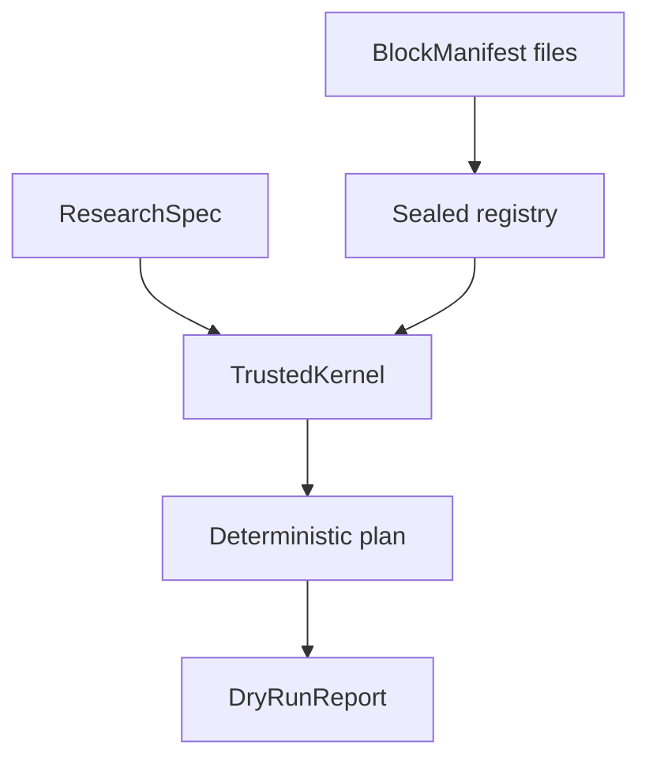

# M0 静态规划内核导读

## 五分钟摘要

### 目标

这一切片回答一个小而关键的问题：在没有执行任何代码之前，系统能否把一个
ResearchSpec 精确地解析成可审查、可复现的计划？

答案现在是可以。任务必须绑定准确的 BlockManifest 版本；Registry 冻结这些声明并
计算摘要；可信内核验证配置、端口、资源和顺序，最后生成 `ready` 或 `blocked` 报告。

### 主要接口

```bash
uv run researchos blocks list
uv run researchos blocks validate MANIFEST.yaml
uv run researchos dry-run RESEARCH.yaml --format json
```

默认文本输出是便于人读的审查概览；版本化 JSON 才是无损、完整的机器计划。

### 安全边界

Dry-run 不是模拟训练，更不是真实训练。它不会导入 entrypoint、运行子进程、联网、
读取运行时路径、求值 `until`、申请 GPU、花钱、写数据库或生成“实验成功”结论。

### 验收证据

测试覆盖精确版本、重复 Registry 项、配置和端口错误、嵌套循环、稳定拓扑排序、
内容摘要、输入快照以及 process/import/network/eval tripwire。Python 3.12 和 3.13
继续由 CI 验证。

## 三十分钟导读

### 数据流



1. `ResearchSpec` 先通过既有结构与跨对象语义验证。
2. 内置和用户明确提供的 BlockManifest 作为数据加载；Registry 拒绝重复版本并封存。
3. 内核复制一份规范快照，避免调用者随后修改原对象影响已经生成的计划。
4. Planner 精确解析每个 `(blockType, blockVersion)`，再验证受限离线配置 Schema 和数据端口。
5. 每层图按拓扑阶段编译，同一阶段按节点 ID 排序；循环体递归编译但不按次数展开。
6. 报告分别给出规范、Registry 与计划摘要，并明确列出四类零副作用。

### 主要文件

| 文件 | 作用 |
|---|---|
| `blocks/models.py` | BlockManifest v0alpha1 编写模型与离线 configSchema 边界 |
| `blocks/registry.py` | 精确解析、重复拒绝、封存与 Registry 摘要 |
| `execution/planner.py` | 端口验证、稳定拓扑阶段、符号循环和资源收集 |
| `execution/kernel.py` | 防御性快照以及 ready/blocked 报告边界 |
| `execution/models.py` | 不可变计划和 DryRunReport 数据模型 |
| `cli.py` | `blocks`、`dry-run` 与多协议 Schema 命令 |

### 为什么必须精确版本

如果 ResearchSpec 只写 `example.train`，Registry 今天可能解析到 0.1.0，明天却解析到
0.2.0。同一不可变研究修订将产生不同含义。因此任务现在必须同时写：

```yaml
blockType: example.train
blockVersion: 0.1.0
```

计划还保存 Manifest SHA-256。即使有人错误地复用同一个版本号发布不同内容，摘要也
会揭示差异。

当前摘要是 Python 参考实现约定，还不是跨语言规范。任何未来执行或缓存都必须同时
绑定 `specDigest + registryDigest + planDigest`，不能只相信 `planDigest`。

### 为什么计划使用“阶段”

两个节点都没有依赖时，它们可以并行。仅仅把节点排成一个列表会错误暗示先后因果。
Planner 因此先产生拓扑阶段，再在阶段内部按 ID 排序。这既表达并行语义，也保证不同
YAML 节点排列生成同一 `planDigest`。

计划不会把边压扁成单纯的先后关系：控制边会保留，数据边还会保留两端端口和类型，
资源则保留 provider、model、费用与时间上限，供研究者在执行前逐项审查。

### 循环如何处理

`maxIterations` 可能很大，dry-run 绝不复制循环体。报告只保存循环上限、成本和时间
边界、checkpoint 声明以及一个嵌套计划模板。`until` 只保存表达式摘要，并始终标为
`evaluated: false`。

### 失败类型

- 输入无效，退出码 `2`：ResearchSpec/Manifest 格式错误、Registry 重复、工作流选择
  不明确等。
- 静态计划被阻止，退出码 `1`：未知精确积木版本、配置不符合 configSchema、端口错误
  或规划规模超过 M0 安全限制。
- 计划完整，退出码 `0`：状态为 `ready`，但仍未授权、未执行。

### 明确留到下一切片

ResearchEvent、SQLite 追加事实源、Run/Attempt 状态机、失败与 unknown 语义、取消、
重试和真正的 SimulatedRuntime 都尚未实现。它们必须一起建立，避免把 handler 返回或
异常错误地记成实验成功。
