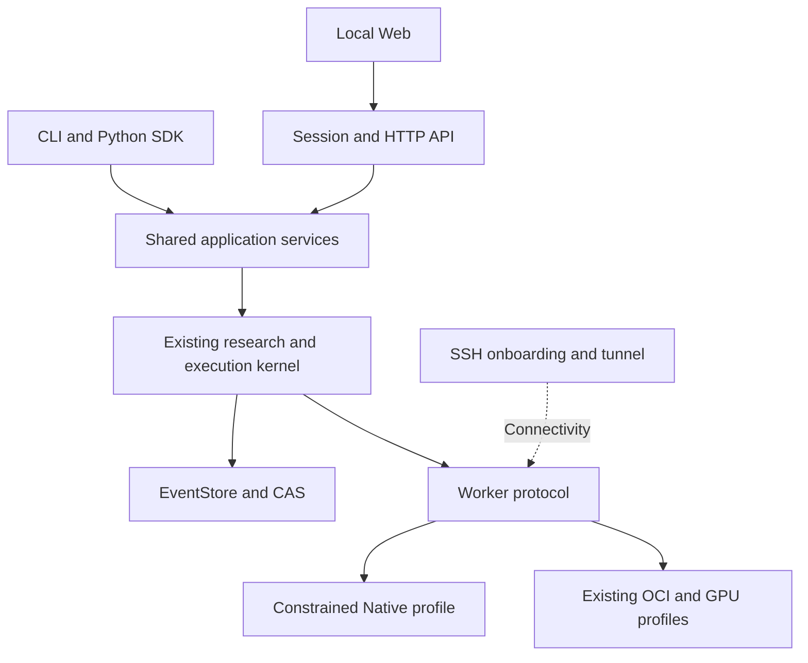

# M3 development plan

Date: 2026-09-17.
Planning baseline: `main@17d18f33902a3b04b211ab0098e4abdb8053e181`.
Status: Planned work; no M3 implementation or acceptance is claimed.

This is the repository's English version of the M3 plan prepared for the
maintainer. It distinguishes accepted constraints, observed implementation, and
recommended additions. Recording the plan does not replace the scope ADR,
acceptance matrix, or current-entrypoint corrections scheduled in M3-00.
New constraints and trade-offs require their respective ADR reviews.

## 1. Intended outcome

**M3 should deliver a local research workbench that an individual researcher can
set up, connect to their own machine, and use to complete a reviewable experiment.**

The first user remains the charter's researcher who understands their question
and can read or modify some Python, but lacks mature training infrastructure.
The recommended first profile is single-user, with one project per workspace
and separate storage for independent workspaces. Team permissions, a hosted
control plane, and multi-tenancy are later work.

The complete user journey is:

1. After installation, start the local interface and an example with one command.
2. Complete an offline simulated research loop without a GPU or API key.
3. Import an experiment definition and a source document; inspect an AI proposal,
   its semantic diff, evidence, predictions, risks, and budget.
4. Accept or reject the proposal while preserving dissent, rationale, and
   necessary researcher questions and answers.
5. Connect a user-owned machine through an existing SSH access path and inspect
   the execution profiles that the machine actually supports.
6. Authorize an exact plan, execute a supported task, and inspect state, logs,
   metrics, and artifacts.
7. Reconnect to observe existing work; see evidence of actual stop after
   cancellation; retain `unknown` when execution cannot be established.
8. Compare a baseline and candidate on a fixed evaluation set, record an
   evidence-linked human conclusion, and create a subsequent revision.

Item 8 is a recommended addition to the inherited M3 scope. M2 demonstrates short
training and restore, but its CUDA live records have no `evaluation.metric`
facts. One small real evaluation should make the result useful for a research
decision.

Engineering acceptance produces a release candidate. The public name, version,
tag, package publication, and paid experiments remain separate actions under
existing project rules. Public distribution of local software does not certify
an internet-facing hosted service.

## 2. Verified starting point and gaps

| Area | Observed state at the planning baseline | Implication for M3 |
| --- | --- | --- |
| Main | `17d18f3`, merging #79 on 2026-09-13 | Start from current main; historical M2 branches supply evidence only |
| CI | Run `34734764131` passed, including Linux/macOS Python 3.12/3.13, Linux OCI, and the 3.14 forward-compatibility job | This is completed remote CI, not a new full test run performed during planning |
| M1 | ADR-0062 accepts the offline loop; #38 closed on 2026-09-13 | Reuse research objects, Mock, budgets, questions, authorization, and reporting |
| M2 | #73, #77, and #78 are merged; local/two-host scope is accepted | Reuse Worker and execution lifecycle semantics |
| Two-host live evidence | Windows/WSL2 + Docker Engine: CPU, reconnect, cancellation, CUDA 20 steps, 22 uploaded files, and full-state 10-to-12 restore | Do not relabel this evidence as native Linux or paid-cloud validation |
| Mac/MPS | A separate LoRA process-group profile has live evidence | Preserve its platform boundary; this is not the generic NativeProcessRuntime |
| Worker authorization | HMAC grants/sessions, expiry, revocation, plan binding, remote consumption, and idempotent claim/complete exist | Do not rebuild Worker identity, leases, or revocation |
| Signatures | #78 supplies detached Ed25519 AuthorizationAttestation | Verification still reports `launchAllowed=false` |
| Issue #53 | Open, narrowed to NativeProcessRuntime authorization consumption | An explicit remaining M3 deliverable |
| UI | Static HTML/Markdown reports | Add service entrypoints, browser authority boundaries, APIs, and interaction |
| Evaluation | CUDA live records have no real evaluation metrics; synthetic metrics and static views exist | Add one fixed, reproducible evaluation loop |
| Unverified scope | Paid-cloud spend is CNY 0; no dedicated two-host unknown live experiment | Local acceptance cannot certify cloud cost controls; add dedicated two-host unknown evidence |
| Documentation | README status is updated, while parts of CONTRIBUTING, first-experiment, and threat-model summaries retain earlier status | Correct current entrypoints; preserve dated evidence and its original outcomes |

Sources: [ADR-0062](../adr/0062-m1-m2-acceptance-and-m3-boundary.md),
[M2 acceptance matrix](../evidence/m2-wsl2-cuda-live/m2-closure-matrix.md),
[Issue #53](https://github.com/victorzhong0110/llm-research-os/issues/53),
[Issue #38](https://github.com/victorzhong0110/llm-research-os/issues/38), and
[baseline main CI](https://github.com/victorzhong0110/llm-research-os/actions/runs/34734764131).

## 3. Scope and priority

| Priority | Work | Acceptance treatment |
| --- | --- | --- |
| Required by the accepted boundary | SSH onboarding, constrained non-OCI execution, NativeProcessRuntime consumption, Web UX, external trials, parsing resource limits, and plugin isolation | Inherited from ADR-0062; do not silently omit at closure |
| Required enabling work | Shared application services, immutable revisions, command idempotency, problem contracts, projections, packaging, diagnostics, and recovery | Necessary to make the inherited outcome usable |
| Recommended addition | One real evaluator, baseline/candidate comparison, and an evidence-linked conclusion | Record explicitly when M3-00 freezes acceptance |
| If capacity remains | A few common parameter forms, limited comparison filters, and additional training views | Must not block the complete loop or create a second experiment definition |
| Deferred | Editable DAG canvas, multi-tenancy, cloud account creation/provisioning, multi-cloud scheduling, a second large training backend, distributed scheduling frameworks, plugin marketplace, vector storage and automatic literature crawling, general autonomous-agent orchestration, and parameter self-evolution | Record future needs; do not prebuild empty frameworks in M3 |

React, TypeScript, Vite, and React Flow are an accepted direction. The charter
requires read-only views before editing and does not require an editable canvas
for the first public MVP. One user-owned GPU path, the already validated training
backend, and one lightweight evaluator are sufficient to test the first outcome.
See [charter sections 14.5 and 18, and erratum E7](../charter-v0.1.md).

## 4. Recommended architecture

| Decision | Recommendation | Reason and boundary |
| --- | --- | --- |
| Core | Retain the modular monolith, SQLite EventStore, and CAS | Existing event semantics remain the fact source |
| Application services | Add a thin `application/` layer shared by CLI, HTTP, and SDK | Reuse ResearchControl, RunControl, WorkerPlane, budget, and evidence logic; adapters cannot bypass the kernel |
| Web backend | FastAPI + ASGI as an optional `web` extra | Fits Python/Pydantic; core CLI and Workers need not install Web or training dependencies; lock versions during implementation |
| Frontend | React + TypeScript + Vite; read-only React Flow | Nodes/edges derive from ResearchSpec; layout stays outside its semantic digest |
| Type generation | Generate protocol TypeScript types from published JSON Schema | Do not hand-maintain another ResearchSpec; OpenAPI wraps HTTP, while the server retains semantic validation |
| Live updates | SSE and bounded queries, with polling fallback | The browser primarily consumes changes; reconnect from a cursor without adding a broker |
| Browser authority | Loopback, same-origin access, a local session, and cross-site mutation protection | Binding to localhost alone does not authorize arbitrary browser writes |
| Worker interface | Retain HTTPS/JSON and `rg1`/`ws1` | Browser sessions and Worker credentials remain separate; no simultaneous rewrite of the verified Worker HTTP server |
| SSH | System OpenSSH and existing trusted Host configuration | Onboarding and connectivity use SSH; tasks still use the Worker protocol |
| Native execution | Explicit profiles behind NativeProcessRuntime | Reuse process observation/stop; begin with reviewed Python tasks and report enforceable constraints honestly |
| Community extensions | Subprocess message protocol; verified OCI boundary for untrusted code | Process separation isolates crashes, not all same-user filesystem or network authority |
| Validation | Existing Python/OCI gates, generated contracts, a small browser E2E suite, and two-host live evidence | Verify failure behavior and authority boundaries instead of inflating snapshot counts |
| Distribution | A standard wheel containing built frontend assets and minimal examples | End users do not need Node; training dependencies remain in the Worker environment |

FastAPI supports modular API routers; React Flow exposes separate controls for
dragging, connecting, and selecting, which suits an initial read-only view.
References: [FastAPI](https://fastapi.tiangolo.com/tutorial/bigger-applications/)
and [React Flow](https://reactflow.dev/api-reference/react-flow).



Neither the browser nor SSH becomes a separate fact source. Cancellation,
recovery, budget, and authorization continue through the same kernel.

## 5. Delivery checkpoints and effort

Estimates assume one implementer assisted by AI, working sequentially. Effective
engineering days include implementation, focused validation, and corrections.
They exclude waiting for hardware, maintainer review/merge, and external trial
participants. AI can shorten coding time but cannot establish unperformed
two-host fault or usability evidence.

| Checkpoint | Packages | Observable outcome | Engineering days |
| --- | --- | --- | ---: |
| A: Inspect | M3-00 through M3-03 | Browser access to real events, research ledger, Run details, and the experiment graph | 6.5-10 |
| B: Connect and control | M3-04 through M3-07 | Native execution, user-owned SSH host, recovery, and unknown evidence | 9-14 |
| C: Complete research | M3-08 through M3-10 | Proposal, decision, execution, evaluation comparison, and human conclusion | 8-11 |
| D: Independent use | M3-11 through M3-13 | Extension boundary, installable package, clean installation, and external trials | 6-10 |
| Total | 14 sequential packages | An M3 release candidate | 29.5-45 |

Allow about 20% integration contingency: approximately **36-54 effective
engineering days, or 7-11 full-time working weeks**. Scale calendar estimates
to actual weekly availability. Re-estimate after M3-03 and M3-07.

The first usable read-only interface should appear after roughly one to two
effective working weeks. If effort must be reduced, keep the scope exclusions
above; retain authorization, observed cancellation, and integrity validation.

## 6. Sequential work packages

Every package below is **planned**. The default is one PR per package. Split a
package into sequential A/B slices if implementation exceeds roughly three days
or becomes difficult to review independently. Merge the prior slice with
maintainer approval and verify actual main CI before starting the next branch.
Do not recreate a long stack of unmerged implementation branches.

### M3-00: Freeze scope and correct current entrypoints

**Effort:** 0.5-1 day. **Dependency:** The accepted M1/M2 baseline.

**Deliverables:** A scope ADR, this maintained English plan, and a planned
acceptance matrix at `docs/evidence/m3/acceptance-matrix.md`. Choose the next
available ADR number at implementation time. Record the starting SHA, platform
scope, non-goals, Issue #53, inherited requirements, and recommended additions.
The presence of this plan supplies the planning document, not the remaining
M3-00 deliverables or scope acceptance.

Correct current status in CONTRIBUTING and its Chinese translation,
`docs/guides/first-experiment.md`, and threat-model summaries. Inspect stale
README prose outside generated status blocks. Preserve historical ADR meaning
and live experiment results; add dated successor links where needed. Keep
accepted-evidence identity distinct from implementation and documentation SHAs
in `docs/status.json`.

Resolve two documentation discrepancies: engineering standards still mention a
first tag after M1, while ADR-0062 requires a separately authorized release;
workflow/CONTRIBUTING descriptions of required jobs differ from the actual main
ruleset. At the audit date, protection requires Ubuntu Python 3.12/3.13 and Human
authorship. macOS and OCI exist as validation jobs. Document that distinction;
any protection change is a separate reviewable action.

**Acceptance:** Map every charter section 14.5 condition; current entrypoints
agree with ADR-0062; generated status and documentation diff checks pass. No
runtime implementation or M3 completion claim belongs in this package.

**Suggested ownership:** Planning/review assistant prepares scope and acceptance;
Cursor edits the frozen documentation slice; the maintainer reviews commitments.

### M3-01: Shared application services and workspaces

**Effort:** 2-3 days. **Dependency:** M3-00.

**Deliverables:** Thin application entrypoints to explicitly create/open a
workspace, read its project, save immutable ResearchSpec revisions, invoke
validate/diff/dry-run, and query the research ledger and Runs. Reuse
`research/control.py`, `runs/control.py`, `execution/`, `report/fold.py`, and
existing storage. Extract only logic required by the new surfaces.

A workspace binds project identity, EventStore, CAS, configuration, and operation
state. Normalize/check paths and reject accidental sharing of control-plane and
Worker roots. The application acts as the existing kernel's caller and supplies
id/time/streamid; preserve explicit identity requirements in low-level APIs.

Define command identity, request digest, the reviewed event head/revision, and a
durable operation receipt. Repeating the same command/content returns its prior
result; reusing an ID with different content fails; stale revisions produce a
conflict. Link receipts to events/artifacts; EventStore remains authoritative
for execution facts. Register payload schemas if new events are needed instead
of introducing an unauditable hidden fact source.

Long operations have recoverable status. After a crash, rebuild facts and pending
receipts rather than treating a browser spinner as evidence of failure. Do not
add Celery or Redis for the first implementation.

**Acceptance:** CLI/application calls have identical semantic digests; revisions
survive restart; conflicts are visible; retries do not create duplicate Runs;
cross-project references fail; core imports and operates without training
extras. Define compatibility with existing SQLite schema v2; new tables or
migrations must preserve historical event digests.

**Suggested ownership:** Cursor implements; the planning/review assistant checks
boundaries, idempotency, and interrupted prefixes.

### M3-02: Web API and input boundaries

**Effort:** 2-3 days. **Dependency:** M3-01.

**Deliverables:** A local API, structured problems, projection reads, and SSE.
The proposed namespace is `/api/v0alpha1`, distinct from Worker `/v0alpha1`.
Initially expose reads, validation, and previews; introduce domain mutations
individually in M3-08/09. Do not expose generic event append or arbitrary command
execution endpoints.

Add same-origin local sessions, Host/Origin checks, CSRF protection for
mutations, and clear authentication failures. A browser session cannot mint its
own Worker authority. Hosted remote mode is outside the default profile.
Credentials and sessions must stay out of ordinary logs, exported facts, and
problem bodies.

Enforce body, nesting, node, time, and concurrency limits during parsing.
Existing YAML depth/node checks largely happen after composition; an 8 MiB source
cap alone does not establish service memory isolation. Use a bounded parsing
process or composer-phase budgets at new remote-facing entrypoints, and test
JSON, YAML, and PDF through their actual parsing paths. Stricter ingress limits
must not prevent historical EventStore replay.

Freeze initial route limits in this package: suggested ordinary JSON limit
1 MiB; specs no larger than the existing 8 MiB ceiling; artifacts use a separate
streaming route and the applicable existing profile bound. Bound aggregate
memory, temporary disk, concurrent uploads, and user quotas using measured
failure cases to set final values.

SSE replays project-scoped cursors without double-counting, and snapshots include
their high-water sequence. A lagging client can reload a snapshot. Preserve
existing heartbeat and metric-storage semantics; do not append every high-rate
sample to the fact log. Read bounded/downsampled data from metric chunks.

**Acceptance:** Cross-site mutation, invalid origins, missing authentication,
wrong-project access, oversized/deep inputs, hostile Markdown/HTML, slow clients,
and duplicate requests have explicit outcomes. SSE reconnect catches up. API
errors do not disclose credentials, arbitrary paths, or input bodies.

**Suggested ownership:** Cursor implements; the planning/review assistant audits
input and interface boundaries.

### M3-03: First read-only research interface

**Effort:** 2-3 days. **Dependency:** M3-02.

**Deliverables:** React/TypeScript/Vite frontend, generated protocol types, and
generation-drift CI. Minimal views: workspace home, research ledger, Run detail,
machine state, and a read-only experiment graph. Reuse report folds on the server;
the frontend does not implement another Run state machine.

Run details show training, evaluation, system, cost, and lineage. State when data
is absent; do not insert zeros, bridge missing series, or relabel synthetic
curves as real. Expose platform/evidence scope. Distinguish unknown, lost, failed,
cancel-requested, and cancel-observed.

The graph supports zoom, selection, and definition inspection. Layout changes
cannot mutate ResearchSpec. A statically displayable workflow may still be
unsupported for execution; show that limitation and disable execution for it.

**Acceptance:** Read actual locally generated M1/M2 records; refresh and restart
preserve state; dissent and decision rationale are discoverable; evidence links
resolve to event IDs or authorized artifacts. Verify small-screen, keyboard,
empty-state, and failure behavior. This delivers checkpoint A.

**Suggested ownership:** Cursor implements; the maintainer browses a real research
record; the planning/review assistant checks semantics and failure states.

### M3-04: Native execution profile and authorization contract

**Effort:** 1-2 days. **Dependency:** M3-03.

**Deliverables:** An ADR defining the first constrained NativeProcessRuntime
profile, pre-launch consumption, capability mapping, and platforms. Review
existing `process.native`/`execute.local` meanings rather than silently expanding
an existing capability into arbitrary host execution. Publish requests, reports,
and valid/invalid examples.

Bind project/Run/Attempt/task, spec/registry/plan/authorization-decision digests,
code artifact digest, interpreter and environment inventory digest,
configuration/input digests, profile version, and resource bounds. An interpreter
path alone does not prove the environment is unchanged.

The recommended first profile executes Python tasks explicitly reviewed by the
user on a local or user-owned machine. Enforce and report process-group
supervision, constrained argv, minimal environment, bounded streams, timeout, and
stop observation. For network, filesystem, and memory limits distinguish
requested, enforced, and unsupported. Do not claim host isolation that is absent.
If policy requires denied network or host access and the platform cannot enforce
it, reject that path and use a supported OCI profile.

This executable profile is not the historical non-launching preflight's fulfilled
promise. Preserve the old preflight's `launchAllowed=false`; separately version
and authorize the actual runtime profile.

Use the trusted control plane and existing Worker grant lifecycle, including for
local execution semantics. Ed25519 verifies facts and is not sufficient launch
authority. Specify the authorization/launch linearization point: revocation
before the gate denies launch; revocation after it enters cancellation/observation
instead of claiming the process never ran.

**Acceptance:** Specify testable denial for wrong project, stale revision,
substituted code/interpreter, expiry/revocation, replayed nonce, incorrect profile,
and unsupported required isolation.

**Suggested ownership:** The planning/review assistant leads contracts and
trade-offs; Cursor implements models, examples, and documentation.

### M3-05: NativeProcessRuntime and Issue #53

**Effort:** 3-5 days. **Dependency:** M3-04.

**Deliverables:** Compose the formal runtime from existing Worker authorization,
binding, recovery, `sandbox.py`, and `supervise.py`, preserving verified
platform-specific behavior. Merely renaming the host-Python helper does not
complete this package.

Before launch, verify the consumed grant, frozen inputs, and profile. Use a fixed
interpreter/runner and constrained argv; never concatenate configuration into a
shell command. Materialize code/inputs from verified CAS; do not import task
entrypoints in the control-plane process. Record process group, start identity,
stream bounds, and observed termination.

Design the handshake and recovery rules across authorization consumption,
durable launch intent, child creation, durable execution identity, and beginning
user code. In particular, cover a child existing before its identity is saved.
If launch cannot be established, retain unknown and never automatically redispatch
the same Attempt. The goal is to avoid duplicate execution and recover honestly,
not to promise generic exactly-once effects across processes.

**Acceptance:** Success, nonzero exit, timeout, output flood, leftover descendants,
PID reuse, denied authorization, pre-launch file substitution, cancellation races,
and crashes at each persistence boundary. Run real process tests for supported
Linux/macOS profiles. Issue #53 becomes eligible for closure only after the
runtime's consume, denial, cancellation, and audit evidence is integrated.

**Suggested ownership:** Cursor implements; the planning/review assistant checks
every failure outcome and the authorization-before-launch property.

### M3-06: SSH onboarding and doctor

**Effort:** 3-4 days. **Dependency:** M3-05.

**Deliverables:** Turn existing `workers pack` capabilities into a planned,
diagnosable, repeatable onboarding flow: probe, produce installation/connection
plan, apply, verify. Freeze actual CLI names in this package; names in this plan
are proposed interfaces.

Use the user's existing trusted SSH Host/agent and verify the host fingerprint.
Do not collect private keys in Web forms. Probe OS, architecture, Python, disk,
GPU/Docker/MPS capabilities, output ownership, network path, and compatibility.
Explain missing prerequisites with concrete repair guidance. Default onboarding
does not run sudo, install system drivers, or modify firewalls.

Install a pinned wheel/locked environment under a user-owned directory and verify
version/digest. Repeated apply must be safe; do not overwrite a mismatched
environment in place. Preserve installation diagnostics. Send remote
configuration through bounded files or stdin. Local `shell=false` does not
prevent SSH's remote shell from interpreting a command: use fixed remote
templates without interpolating user-supplied paths or options.

Support two explicit connectivity profiles: HTTPS on an existing private network,
or a reverse tunnel over existing SSH that binds only to remote loopback. The
Worker still initiates HTTPS requests. No new Worker application listener is
needed; the user must already have SSH access to that host.

Diagnose loopback binding, host verification, forwarding setup failure, liveness,
and reconnection. A successfully created forward does not prove that its target
service is reachable: verify the actual HTTPS handshake and Worker registration.
Certificate SAN must match the Worker's connection name; never disable TLS
verification. References: [OpenSSH configuration](https://man.openbsd.org/ssh_config)
and [SSH forwarding](https://man.openbsd.org/ssh).

**Acceptance:** Clean remote onboarding, wrong host fingerprint/certificate,
missing Python, permissions, full disk, incompatible versions, port conflict,
and disconnection are diagnosable. Control SQLite/CAS/TLS private key do not enter
the Worker root. Repeated installation does not duplicate registration or launch
training.

**Suggested ownership:** Cursor implements; the maintainer supplies existing test
host access; the planning/review assistant reviews connectivity and evidence.

### M3-07: Two-host faults and recovery

**Effort:** 2-3 days. **Dependency:** M3-06.

**Deliverables:** Validate the new onboarding path on two real machines, first
with a small CPU task and then one existing GPU profile. Use new authorization
and execution identities; never reuse cuda.1-11. Create an independent evidence
pack recording commit, package identity, both environments, profile, inputs, and
event/artifact digests.

Required fault points: disconnect before claim; SSH tunnel loss during execution;
control-plane restart; Worker restart; interrupted artifact upload; lost complete
response after upload; cancellation while disconnected; and unknown caused by
unavailable process identity observation. Reconnect resumes observation, upload,
or receipts without spawning claimed work again.

Resolve checkpoint delivery explicitly. M2 demonstrates upload and control-side
verification, while Worker GET of ordinary artifact blobs remains restricted by
design. Control-plane-to-Worker checkpoint delivery requires a task-authorized
input materialization/download path; never open the whole CAS. If only
Worker-cached checkpoints are supported, the UI and acceptance must state the
limitation and verify their integrity.

The recommendation is to implement grant-scoped checkpoint input transfer in M3:
verified control-plane artifact to the designated Worker and new Run/Attempt.
Retain profile file-count/size bounds. File-level retry is an adequate first
resumption mechanism; do not expand immediately to arbitrary large objects.

**Acceptance:** Every fault has events, real process/container observation, and
residual-executor checks. Record dedicated two-host unknown evidence. A cancel
request is not displayed as stopped; full-state restore remains distinct from
adapter loading; an Attempt never gets a second training process. Checkpoint B
is complete after this package.

**Suggested ownership:** The planning/review assistant audits evidence; Cursor
fixes identified faults; the maintainer runs or authorizes validation on existing
hardware.

### M3-08: Research workflow and AI proposal interaction

**Effort:** 3-4 days. **Dependency:** M3-07.

**Deliverables:** Workspace creation, evidence import, proposal, dissent,
questions, decisions, and new revisions through shared services. Supply an
end-to-end deterministic Mock path and connect the existing OpenAI-compatible
adapter for user-configured models. M1 already supplies low-level `ai.call` and
research facts; this package adds orchestration that validates generated output
before turning it into a reviewable proposal.

Every proposal binds a base revision, complete candidate spec in CAS,
server-computed semantic diff, evidence, predictions, falsification conditions,
risk, and budget. Models cannot grant authority or make researcher decisions.
Invalid schema or unresolved references produce a visible failure/pending repair,
not execution. An AI edit first produces a draft.

Preserve human rationale and overridden dissent. Use `question.asked` and
`question.answered` for necessary information, explaining why the unknown matters
to the decision. Reuse `ai.call.*` and `budget.*`; an uncertain dispatched request
must not release its reservation and retry indefinitely.

Display evidence origin, snapshot, and permitted uses. Reading permission does
not imply training permission. Browser excerpts use authorized, bounded artifact
reads rather than embedding whole private sources into events.

**Acceptance:** Complete the Mock journey with no key. Validate real HTTP
interaction against a local compatible server. Rejection queues no Run; stale
proposals cannot overwrite later revisions; hostile evidence cannot invoke tools
or change permissions; refresh preserves decisions. Paid external-model trials
have separate budgets and are not prerequisites for offline acceptance.

**Suggested ownership:** Cursor implements; the planning/review assistant checks
research semantics; the maintainer evaluates language and usability.

### M3-09: Web execution, cancellation, and restore

**Effort:** 2-3 days. **Dependency:** M3-08.

**Deliverables:** Show dry-run, execution profile, target Worker, actually
enforced constraints, resources/budget, and actions awaiting authorization.
Accepting a research proposal and authorizing execution are distinct business
states even if the UI guides the user through them consecutively.

Execution accepts only a frozen, currently valid plan identity. Start, cancel,
and restore use M3-01 receipts. Double-clicks, retransmission, timeouts, and
multiple tabs must not duplicate dispatch. Return Run/operation identity and
query facts for progress.

For unknown or lost work, offer reconnect/observe-existing-work actions. A new
attempt requires explicit handling of the old Attempt, new authority/decisions,
and a valid state transition. Restore shows checkpoint digest and restore mode;
unsupported profiles fail closed.

**Acceptance:** Browser E2E covers start, duplicate clicks, stale plans,
cancel-requested versus observed stop, offline reconnect, completion recovery
after upload, and domain errors. UI, CLI, and replay agree on state.

**Suggested ownership:** Cursor implements; the planning/review assistant tests
semantics and API replay; the maintainer completes a remote workflow.

### M3-10: Minimal real evaluation, comparison, and conclusion

**Effort:** 3-4 days. **Dependency:** M3-09.
**Scope status:** Recommended addition to be recorded in M3-00.

**Deliverables:** One deterministic evaluator and fixed evaluation set, using the
already validated small-model/ms-swift path. Install evaluation dependencies on
the Worker while retaining an independent core. No model judge, external
leaderboard, or second training framework is required.

Record data digest, split, rights, model/tokenizer versions, evaluator version,
and configuration first. A useful first example computes token-weighted held-out
loss/NLL and retains a small set of outputs for identical inputs. Add exact match
only for a task with a clear scoring definition. Do not mix training and
evaluation data. A short LoRA run's negative result is valid; model improvement
is not an engineering acceptance condition.

Compare a baseline model and one candidate checkpoint. Recompute aggregates from
bounded detail artifacts; show sample count, missing/failed cases, metric
direction, and aggregation definition. Mark differing evaluator/configuration
results as not directly comparable instead of simply plotting them together.

Keep execution narrow. Training and evaluation may be two Runs with explicit
artifact dependency, coordinated by a bounded application recipe and linked
report. Do not first build a general DAG scheduler; graph visibility does not
make an unsupported multi-node workflow executable.

Conclusion drafts cite actual metrics, event IDs, and artifact digests. Humans
record supported, not supported, or insufficient-evidence judgments while
retaining dissent. If a separate conclusion object is introduced, version its
schema; do not insert new values into the existing `Decision.outcome` enum. A
minimal implementation can link a conclusion artifact to existing Run decisions
and review facts.

**Acceptance:** A small CPU case validates the evaluator protocol. On one
supported hardware profile, perform real baseline/candidate evaluation. Keep
synthetic and real results distinct; recomputation matches the report; absent
metrics never imply a supported hypothesis. This completes checkpoint C.

**Suggested ownership:** The planning/review assistant defines methodology and
evidence; Cursor implements evaluator/comparison UI; the maintainer checks that
the example question and explanation are useful.

### M3-11: Minimal extension boundary

**Effort:** 2-4 days. **Dependency:** M3-10.

**Deliverables:** A versioned subprocess protocol, manifest/capability
negotiation, timeout, output limits, problem mapping, and conformance examples
for the first external adapter. Choose a small extension without paid effects,
such as an evaluation-output converter. Defer a marketplace and automatic
discovery/installation.

Manifest loading remains inert and cannot import external entrypoints. Do not
pass EventStore connections, control-plane keys, or arbitrary host file handles
to an extension. Minimize its environment and mediate external access through
policy-controlled paths.

Claim only the isolation T2 actually provides. A same-UID subprocess can still
access user files and networking; it is not a malicious-code sandbox. Untrusted
arbitrary code requires OCI or another verified OS boundary. If unavailable,
reject the extension rather than silently falling back to host execution.

**Acceptance:** Crash, hang, output flood, excess capabilities, and incompatible
versions do not corrupt the control plane. Route high-risk plugins into enforced
isolation or refuse them. Removing ms-swift leaves the core, offline demo, and
generic Python brick usable. Pass this gate before accepting the first community
adapter.

**Suggested ownership:** Cursor implements; the planning/review assistant audits
capability and trust boundaries.

### M3-12: Packaging, startup, and recovery diagnostics

**Effort:** 2-3 days. **Dependency:** M3-11.

**Deliverables:** Include built Web assets, offline templates, and examples in the
wheel. Proposed post-install entrypoint: `researchos start --demo`; this command
does not exist merely because the plan names it. Make workspace creation explicit
and never overwrite a conflicting existing path. Startup should not require a
source checkout, Node, training frameworks, or hand-edited protocol JSON files.

Doctor reports versions, ports, disk, workspace structure, Worker connectivity,
certificates, and supported execution capabilities with actionable remedies.
Diagnostics export is field-redacted and inspectable before sharing.

Backup freezes an EventStore high-water mark and enumerates immutable CAS objects
referenced by that prefix; do not copy a live SQLite file casually. Restore to a
new directory and verify events/objects. Restoring a database does not restart
old tasks. If upgrades require a schema migration, back up first and document
downgrade compatibility. Automatic artifact GC is out of scope.

**Acceptance:** Clean Apple Silicon Mac and Linux installations run the built
package outside the checkout, without Node or training extras. Diagnose port
conflicts, damaged workspaces, missing static files, interrupted backups, and
restore failures. Successful restore preserves digests and the research ledger.

**Suggested ownership:** Cursor implements; the planning/review assistant checks
reconstruction and package assets; the maintainer tries a clean Mac installation.

### M3-13: External trials and milestone closure

**Effort:** 2-3 days, excluding time waiting for participants.
**Dependency:** M3-12.

**Deliverables:** At least two people matching the intended audience who did not
implement the system independently follow the documentation through the offline
journey. At least one also connects a user-owned remote host and runs a small
task. The maintainer arranges invitations; the plan does not send messages.

Record failed steps, elapsed time, developer interventions, hand-edited settings,
unclear diagnostics, and misunderstood conclusions. Fix main-path blockers and
repeat affected paths rather than indiscriminately rerunning every test.

Publish an evidence index under `docs/evidence/m3/`, platform matrix, limitations,
supported/unsupported profiles, and the final main SHA/CI links. Update English
README and its Chinese translation, getting-started documentation, and generated
status. Record actual accepted scope in a separate closure ADR.

**Acceptance:** Complete the matrix below or obtain an explicit scope adjustment.
No unresolved unauthorized launch, duplicate execution, false stop, data
corruption, or fabricated-success issue remains. Unperformed hardware checks
stay unverified. Record engineering completion, publication readiness, and actual
publication separately; do not automatically tag, publish, or deploy. This
completes checkpoint D.

## 7. Proposed code and interface placement

Confirm paths and names against the code during each slice. Do not create empty
modules in advance.

| Location | Responsibility | Packages |
| --- | --- | --- |
| `src/llm_research_os/application/` | Workspaces, shared commands, receipts, bounded workflow coordination | 01, 08, 09, 10 |
| `src/llm_research_os/web/` | Sessions, API, SSE, static-asset entrypoint | 02, 12 |
| `web/` | React UI, generated types, frontend checks | 03, 08, 09, 10 |
| `execution/` and `workers/` | Native profile, authority binding, execution, recovery | 04, 05, 07 |
| SSH module under `workers/` | Onboarding plan, probe, install, tunnel, diagnostics | 06 |
| `evaluation/` or one adapter module | Evaluator contract, comparison, detailed artifacts | 10 |
| `plugins/` or adapter-boundary module | External process protocol and conformance | 11 |
| `tests/` and frontend test directories | Contract, fault, real-process, and focused browser tests | With each slice |
| `docs/protocols/` and `docs/guides/` | External contracts, usage, limitations | With each slice |
| `docs/evidence/m3/` | Evidence index, environments, acceptance, limits | 07, 10, 13 |

Organize API operations around project/revisions, proposals/dissents/questions/
decisions, plans, runs, workers, artifacts, and event streams. Long model/start/
stop operations return an operation identity and inspectable result instead of
blocking request handling for minutes. Reads use projections; each mutation maps
to an existing or explicitly introduced domain command.

## 8. Public-MVP acceptance mapping

All rows below describe **planned evidence**, not completed M3 checks.

| Charter section 14.5 condition | Implementation | Required evidence |
| --- | --- | --- |
| 1. One-command Mac/Linux startup | M3-12 installed package and demo entrypoint | Clean-install records on both platforms |
| 2. Complete simulation without GPU | M3-08/12 | Offline, no-key, no-training-extras accept/reject flow |
| 3. Connect a user-owned remote GPU | M3-06/07/09 | New two-host onboarding, GPU profile, task and authorization identities |
| 4. Inspect the same experiment definition | M3-01/03 | YAML/SDK/UI refer to the same revision and semantic digest; read-only graph creates no separate spec |
| 5. Review every AI change | M3-08 | Diff, evidence, predictions, risk, and budget; invalid references rejected |
| 6. Human rejection and preserved dissent | M3-08 | Rejection creates no Run; rationale/dissent survive refresh |
| 7. Stop and distinguish execution states | M3-05/07/09 | Actual process exit, reconnection, and independent unknown evidence |
| 8. Complete result lineage | M3-03/07/10 | Verifiable data, code, environment, configuration, sources, and output digests |
| 9. Core survives training-adapter removal | M3-11/12 | Installed wheel, simulation, and generic Python brick without ms-swift |
| 10. Versioned core contracts and tests | Every slice | Generated schema, valid/invalid examples, generated TS, and semantic contracts agree |

Additional M3 gates: Native consumption evidence for #53; input resource
boundaries; extension isolation; at least two target-user trial records; and the
recommended real evaluation comparison if adopted in M3-00.

## 9. Validation and success measures

### Validation layers

| Layer | Checks | Limitation |
| --- | --- | --- |
| Pure models/properties | Digest, schema, diff, state machine, authority binding, idempotency/conflicts, references | Does not prove actual stop or remote networking |
| Local integration | Installed package, API, SSE, real child process, restart, backup/restore, absent training extras | Does not prove SSH or remote GPU |
| Browser E2E | Offline journey, reject, duplicate click, stale plan, cancellation request, errors/empty states | Does not replace executor evidence |
| Designated Linux OCI CI | Real containers and live faults; missing runtime is failure | Does not certify MPS, WSL CUDA, or paid cloud |
| Two-host live | SSH/TLS, independent roots, CPU, disconnect, cancel, unknown, artifacts, one GPU path | Does not generalize to every cloud or GPU |
| External trial | Install, understand, complete, diagnose, count interventions | Two participants are not a statistically representative sample |

Run relevant behavior checks and repository gates for each change. Preserve the
unrounded 85% statement-plus-branch coverage floor, ruff, formatting, mypy,
generated schemas, JCS conformance, event catalog/status generation, wheel build,
and installed-wheel smoke. Required protocol selection follows current CI's
`not oci_live and not slow`; designated OCI runs separately. Add frontend build,
type checks, generated-contract drift, and essential E2E checks.

These are implementation gates. Planning verified existing remote CI; it did
not test unimplemented M3 behavior.

### Suggested measurement targets

| Measure | Target | Measurement boundary |
| --- | --- | --- |
| First offline result | Within 5 minutes after template initialization | Exclude installation download; separate system and reading time |
| New-user offline journey | Both trial users finish within 15 minutes without developer file edits | Prerequisites installed; documentation allowed; report each result without population-level claims |
| First SSH onboarding | Within 20 minutes when prerequisites exist; no hand-filled tokens/multiple protocol JSON files | Record environment/model download time separately |
| Denied launch | Zero launches for denied, stale, mismatched identity/digest cases | Within the declared fault/live matrix |
| Duplicate dispatch | Zero extra starts for the same command/Attempt in the fault matrix | No generic exactly-once promise |
| Honest state | Unknown and cancel-requested never appear as success/stopped in acceptance cases | Compare events and real executor observation |
| UI freshness | Suggested P95 event-to-view at most 2 seconds | Fixed host/data volume; disconnections measured separately; not an existing SLA |
| Interactive query | Suggested P95 at most 300 ms for common queries at 10k events; bounded behavior at 100k | Establish M3-02 baseline; optimize projections/paging before changing databases |
| Attention cost | Count manual inputs, blocking questions, repeated authorization, and developer interventions | Reduce questions the system can resolve; retain necessary research decisions |
| Real evaluation | Recompute one baseline/candidate comparison from detail artifacts | Negative outcomes are acceptable; quality improvement is not a gate |

## 10. Risks and responses

| Risk | Early signal | Response |
| --- | --- | --- |
| UI duplicates the kernel | Frontend/routes independently decide authorization, budgets, or Run state | Shared services and CLI/API semantic-contract checks |
| Native isolation is overstated | Documentation promises no network but code only cleans env or starts a process group | Report actual enforcement; reject unmet policy; distinguish reviewed and untrusted code |
| Browser retries duplicate work | A timed-out POST simply creates a new Run | Stable commands, durable receipts, consumed grants, launch handshake, observation on uncertainty |
| SSH becomes another executor | Training runs directly through SSH and its exit code substitutes for Worker facts | Keep SSH in onboarding/connectivity; execute through Workers |
| UI hides missing research evidence | A green experiment-success label appears without evaluation | Separate execution completion and conclusion review; show missing evidence |
| Old docs override current state | Contributors follow M1 or generic pending-live guidance | Correct current entrypoints, date history, link successors, keep generated status authoritative |
| Platform scope expands prematurely | Work shifts into multi-cloud, marketplaces, tenancy, or arbitrary DAGs | Return to the four checkpoints; put additions into backlog |
| Manual packaging remains hidden | UI launch still requires editing several request/grant JSON files | Application services prepare identities/configuration/dependencies; retain an expert export path |
| Restore prerequisites are incomplete | UI offers resume while the checkpoint exists only on control CAS | Deliver grant-scoped input transfer in M3-07 or explicitly block unsupported restores |
| Evidence is relabeled to new code | Historical hardware evidence is shown as a pass on the latest SHA | Record implementation SHA, build digest, and live-runtime SHA independently |

## 11. Collaboration and PR rules

Retain the maintainer's existing workflow: sequential packages, Cursor contributes
implementation, and the maintainer controls merges. Update this allocation only
when the maintainer changes it.

1. The planning/review assistant prepares the current package's base, allowed
   paths, interfaces, acceptance, and non-goals.
2. Cursor implements only that package and describes alternatives when an
   accepted constraint needs to change.
3. The planning/review assistant reviews diffs, failure behavior, evidence,
   language, and documentation consistency and provides concrete corrections.
4. Each PR is independently reviewable; merge requires maintainer confirmation.
   Do not auto-merge or use an administrator bypass.
5. After squash integration, check actual main CI before starting the next
   implementation branch from main.

Code, maintained protocols/ADRs/guides, and commit messages use English. README
and CONTRIBUTING retain synchronized Chinese translations. This file is the
maintained English plan; do not add a second complete Chinese engineering-plan
copy to the repository.

Dependency PRs #74 (pypdf) and #76 (developer tooling) were open at the planning
audit. Review/integrate them independently of feature slices. For the parser
update, verify existing PDF boundaries; for tooling, inspect lint, typing,
lockfile, and existing CI behavior. Do not upgrade every dependency merely to
begin M3.

At the audit date, main protection requires Ubuntu Python 3.12/3.13 and Human
authorship. Once stable, consider making essential Web checks, Linux OCI, and
appropriate macOS checks explicit merge gates. Prepare a reviewable proposal and
obtain maintainer confirmation before changing rules.
[Audited main ruleset](https://github.com/victorzhong0110/llm-research-os/rules/22190429).

## 12. Product recommendations

**Use the interface early.** M3-03 supplies a read-only surface. From M3-09,
perform ordinary demonstrations and diagnosis through actual user entrypoints.
Record remaining maintainer-only edits as usability defects instead of hiding
them inside demonstration scripts.

**Organize the home view around question, prediction, evidence, decision, and
result.** GPU, jobs, and logs are accessible details within that research journey.
Existing dissent and question protocols should visibly help the researcher judge
what to do next.

**Keep the first real evaluation small.** A reproducible and explainable baseline
comparison, including failure or a negative result, demonstrates the research
value. Expand interfaces based on that experience.

**Treat diagnostics as a central feature.** Identify whether a first connection
failed because of Python, ownership, certificates, network, cached models, or
profile incompatibility, and state the next repair. Preserve machine-readable
problem codes alongside short user explanations.

**Plan distribution and hosting separately.** The local workbench with user-owned
Workers serves the first audience. Hosted accounts, tenancy, internet ingress,
and operations warrant a later plan informed by usage.

**Freeze scope now, not every future internal API.** Review public contracts
carefully, allow internal application services to improve after trials, and
preserve model/backend/compute neutrality while completing one useful journey.

## 13. M3-00 handoff for Cursor

```text
Repository: victorzhong0110/llm-research-os
Work package: M3-00 — scope, acceptance matrix, and current-entrypoint corrections

Start from the latest verified main. The planning audit used
17d18f33902a3b04b211ab0098e4abdb8053e181; inspect subsequent changes if main moved.
Read applicable AGENTS.md, CONTRIBUTING.md, docs/engineering-standards.md,
docs/charter-v0.2.md, charter v0.1 sections 14.5 and 18 with incorporated errata,
ADR-0062, the M2 acceptance matrix, Issue #53, and this plan before editing.

Goal:
Prepare the reviewable scope and acceptance record for a single-user,
local-first research workbench: shared application services, local Web UX,
constrained NativeProcessRuntime authorization consumption, SSH onboarding of
a user-owned host, recovery, bounded parsing, extension isolation, packaging,
and external trial acceptance. Include one small real evaluation/comparison
slice as a proposed addition, distinct from already accepted requirements.

Deliver:
1. A proposed scope ADR using the next available number.
2. Review/update the existing docs/plans/m3-development-plan.md rather than
   creating a competing plan. Preserve sequence, dependencies, evidence,
   non-goals, and estimates unless explaining a necessary adjustment.
3. A planned docs/evidence/m3/acceptance-matrix.md mapping every charter 14.5
   condition and the explicit ADR-0062 deferrals to work packages.
4. Corrections to CURRENT entrypoints that still say M1 is current, charter
   v0.2 is missing, or all two-host work is pending. Preserve dated evidence,
   failed/partial CUDA records, and historical ADR meaning.
5. Synchronized README/CONTRIBUTING translations where those files change.
6. A PR explaining the need, intended M3 outcome, validation, and decisions
   that require maintainer acceptance.

Constraints:
- One sequential package. No Web, SSH, native runtime, evaluation, or plugin
  implementation in this PR.
- Reuse Worker HMAC grants, expiry, revocation, and leases.
- Fact signatures and native preflight are not launch authority.
- Do not relabel WSL2/MPS evidence as native Linux or paid-cloud evidence.
- Preserve low-level identity, digest, and append-only event contracts.
- Distinguish accepted evidence identities from the latest docs SHA.
- Mark proposed CLI/API names as proposed, not available functionality.
- Do not merge, change protection, tag, publish, provision a host, or start
  live training/model calls.

Validation:
Run documentation diff checks and the project-status generator check where
relevant. Use existing PR CI. Do not fabricate live evidence or add mirror
tests for documentation edits. Report exact commands/outcomes. Begin the next
package only after maintainer-approved integration and successful actual main CI.
```

## 14. Supporting material

Repository implementation was inspected at the fixed planning baseline. Issue,
ruleset, and CI observations are dated 2026-09-17. Recommendations and estimates
are engineering judgments, not completed implementation or accepted ADRs.

- [Charter v0.2](../charter-v0.2.md): retained research and governance constraints.
- [ADR-0062](../adr/0062-m1-m2-acceptance-and-m3-boundary.md): accepted checkpoints
  and explicit M3 deferrals.
- [M2 live matrix](../evidence/m2-wsl2-cuda-live/m2-closure-matrix.md): platform,
  restore, upload, evaluation, and unknown evidence limits.
- [ADR-0008](../adr/0008-native-process-and-oci-runtimes.md): dual runtimes and
  non-launching native preflight.
- [ADR-0009](../adr/0009-worker-semantics-independent-of-transport.md) and
  [ADR-0021](../adr/0021-remote-worker-transport.md): semantic Workers and SSH
  bootstrap; their pending-live language describes their historical slices.
- [ADR-0061](../adr/0061-detached-authorization-attestations.md): signed facts
  versus execution authority.
- [Research decision protocol](../protocols/research-decision-objects-v0alpha1.md):
  proposal, dissent, decision, question/answer, and field constraints.
- [WorkerPlane](../../src/llm_research_os/workers/plane.py) and
  [supervision](../../src/llm_research_os/workers/supervise.py): existing lease,
  consume, process-observation, and recovery boundaries.
- [Input parsing](../../src/llm_research_os/spec/io.py) and
  [threat model](../security/threat-model.md): local bounds and service gaps.
- [Engineering standards](../engineering-standards.md) and
  [CI workflow](../../.github/workflows/ci.yml): language, slices, coverage, and
  packaging gates.
