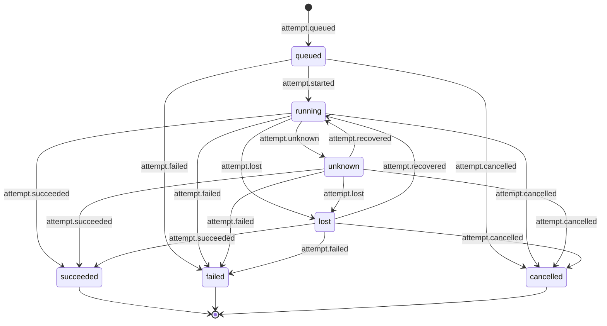
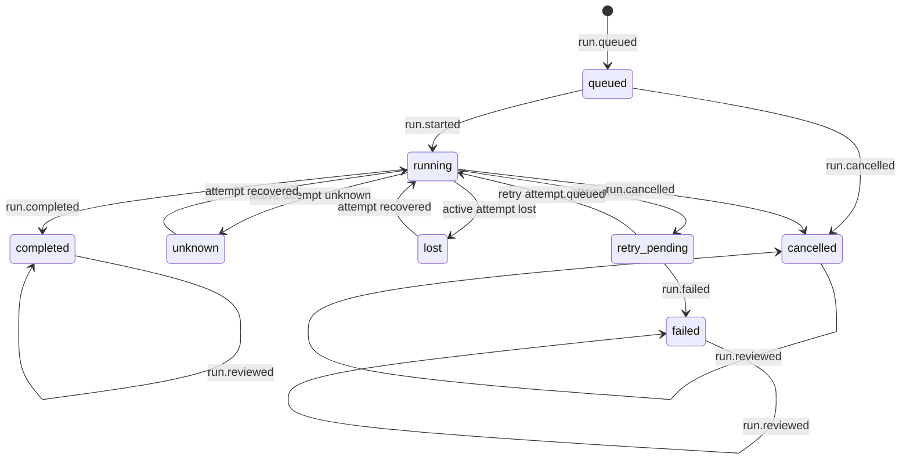

# Run/Attempt State v0alpha1

> Status: Experimental projection contract  
> Domain version: `v0alpha1`  
> JSON Schema: `schemas/run-state/v0alpha1.schema.json`

This slice freezes a **pure, replayable Run/Attempt state machine**. Dashboards, workers
and adapters MUST fold already-validated ResearchEvents. They MUST NOT treat a mutable
row, a lease, or a missing heartbeat as a second source of truth.

The key words **MUST**, **MUST NOT**, **SHOULD** and **MAY** are normative requirements in
this document.

This slice freezes only the lifecycle event **subset** listed below. It does **not**
freeze the complete ResearchEvent `type` catalog. Stream identity (`streamid` granularity
and its relation to `runId`) remains undecided.

## 1. Authority layers

1. The committed JSON Schema is the language-neutral structural contract for `RunSnapshot`.
2. This document defines semantic rules that JSON Schema cannot express completely.
3. Positive and negative traces form the initial conformance corpus.
4. The Python package is the first reference implementation, not an additional hidden protocol.

The reducer is a trusted-kernel concern: plugins and adapters MUST NOT invent hidden
transitions from other event types.

## 2. Purity

`RunStateProjection` is a total fold:

```python
from llm_research_os.runs import RunStateProjection
from llm_research_os.projections import fold_events

projection = RunStateProjection(
    project_id="project.example",
    run_id="run.example",
)
snapshot = fold_events(events, projection)
```

- `initial_state()` returns `None`.
- `apply()` returns a new frozen snapshot from one verified `ResearchEvent`.
- The reducer MUST NOT read or write a database, file, environment variable, clock, random
  number, network, process or other runtime.
- It MUST NOT generate or append events.
- A complete fold, a checkpoint/resume fold, and a rebuild from EventStore replay MUST
  produce the same snapshot.

## 3. Aggregate and order

- The Run aggregate key is `(data.projectId, data.runId)`. `runId` alone is not globally unique.
- Events whose `data.runId` is missing, or that belong to another project/run, are not part of
  the target aggregate and MUST be ignored by that projection.
- The reducer MUST NOT depend on `streamid` or `streamversion`. It MUST NOT require
  `streamversion` to be contiguous.
- Related events are applied in global `sequence` order. `sequence` MUST increase strictly.
  Gaps are allowed because other Runs may interleave.
- Events MUST NOT be ordered by `time`. The reducer MUST NOT read the current time.
- After the aggregate is established, `experimentRevision` MUST NOT drift.
- Lifecycle events MUST have `blockId` null.
- Run-level lifecycle events MUST have `attemptId` null.
- Attempt-level lifecycle events MUST have a non-empty `attemptId`.
- Any other ResearchEvent `type` remains auditable and MUST NOT change Run or Attempt status.

## 4. Frozen status sets

`RunStatus`:

- `queued`
- `running`
- `retry_pending`
- `lost`
- `unknown`
- `completed`
- `failed`
- `cancelled`

`AttemptStatus`:

- `queued`
- `running`
- `lost`
- `unknown`
- `succeeded`
- `failed`
- `cancelled`

Run and Attempt each store a monotonic `cancellationRequested` flag:

- `false` MAY become `true`;
- `true` MUST NOT return to `false`;
- a cancellation **request** is not a cancelled **outcome**.

Terminal statuses:

- Run: `completed`, `failed`, `cancelled`
- Attempt: `succeeded`, `failed`, `cancelled`

`lost` and `unknown` are unresolved/active. They are not terminal. Implementations MUST NOT
infer failure, success or cancellation from them.

`reviewed` is not a `RunStatus`. It is derived from the `review` audit fields after a terminal
Run status. It does **not** mean that a research hypothesis was supported.

## 5. Frozen lifecycle catalog

Only these exact `type` values change or confirm Run/Attempt state.

Run:

- `run.queued`
- `run.started`
- `run.cancel.requested`
- `run.completed`
- `run.failed`
- `run.cancelled`
- `run.reviewed`

Attempt:

- `attempt.queued`
- `attempt.started`
- `attempt.heartbeat`
- `attempt.cancel.requested`
- `attempt.unknown`
- `attempt.lost`
- `attempt.recovered`
- `attempt.succeeded`
- `attempt.failed`
- `attempt.cancelled`

Other ResearchEvent types MUST remain no-ops for this projection. Adapters MUST NOT
reinterpret them as hidden transitions.

## 6. Closed payloads

Each lifecycle type has a closed, strict payload. External documents MUST use Schema aliases
only. Implementations MUST NOT trim identity strings, coerce JSON types, or accept unknown
fields.

| Type | Payload |
|---|---|
| `run.queued` | `{ workflowId, specDigest, registryDigest, planDigest, decisionDigest?, maxAttempts }` |
| `run.started` | `{}` |
| `run.cancel.requested` | `{ reasonCode }` |
| `run.completed` | `{}` |
| `run.failed` | `{ reasonCode }` |
| `run.cancelled` | `{}` |
| `run.reviewed` | `{ decisionId }` |
| `attempt.queued` | `{ ordinal, retryOf, retryDecisionId }` |
| `attempt.started` | `{}` |
| `attempt.heartbeat` | `{}` |
| `attempt.cancel.requested` | `{ reasonCode }` |
| `attempt.unknown` | `{ reasonCode }` |
| `attempt.lost` | `{ reasonCode }` |
| `attempt.recovered` | `{}` |
| `attempt.succeeded` | `{}` |
| `attempt.failed` | `{ reasonCode, retryHint }` |
| `attempt.cancelled` | `{}` |

`maxAttempts` is a strict integer in `1`–`32`. It is an immutable M0 Run **policy snapshot**.
It does not claim that the same field already exists on ResearchSpec. `32` is the M0 memory
and retry cap.

`retryHint` is `retryable`, `not-retryable` or `unknown`. It is a worker/caller fact or
suggestion. It is **not** authorization. Creating a retry requires a new `attempt.queued`
with an explicit `retryDecisionId`. This reducer only checks that the decision identifier is
present. It does not pretend to verify decision-maker authority.

The first Attempt MUST have `ordinal` `1` and explicit JSON `null` for `retryOf` and
`retryDecisionId`. A retry MUST use a new `attemptId`, `ordinal = previous + 1`, `retryOf`
equal to the latest **failed** Attempt id, and a non-empty `retryDecisionId`. Forking, skipped
ordinals and reused Attempt IDs are illegal.

## 7. Run creation and immutable binding

`run.queued` MUST be the first lifecycle event of the aggregate. It uniquely binds:

- `projectId`
- `experimentRevision`
- `runId`
- `workflowId`
- `specDigest`
- `registryDigest`
- `planDigest`
- optional `decisionDigest` (in-process plan-authorization gate identity)
- `maxAttempts`

`planDigest` MUST NOT be treated as Run identity by itself. After `run.queued`, those bound
values MUST NOT change. Every Attempt belongs to that immutable Run binding.

`decisionDigest` MAY be omitted on generic traces that never passed the authorization gate.
When present, it MUST be a tagged semantic digest and MUST equal the in-process
`authorize_plan` result that allowed the Run to start. JSON `null` is invalid. The field is
not an audit-event citation, signature, or launch token. SimulatedRuntime always writes it.

## 8. Attempt transitions



`attempt.cancel.requested` and `attempt.heartbeat` do not change `AttemptStatus`.

- `attempt.queued` is allowed only after the Run has started, with no unresolved Attempt and
  without a Run cancellation request. The first Attempt is created at ordinal 1. A retry is
  allowed only after the latest Attempt failed. The Attempt count MUST stay below `maxAttempts`.
- `attempt.started`: `queued` → `running`.
- `attempt.heartbeat` is allowed only in `running`. It updates `lastHeartbeatSequence` and other
  observation fields. Missing heartbeats MUST NOT produce `lost`, `unknown` or `failed`.
- `attempt.cancel.requested` is allowed from `queued`, `running`, `lost` or `unknown` and only
  sets `cancellationRequested`.
- `attempt.unknown`: `running` → `unknown`.
- `attempt.lost`: `running` or `unknown` → `lost`.
- `attempt.recovered`: `lost` or `unknown` → `running`.
- `attempt.succeeded`: `running`, `lost` or `unknown` → `succeeded`.
- `attempt.failed`: `queued`, `running`, `lost` or `unknown` → `failed`.
- `attempt.cancelled`: `queued`, `running`, `lost` or `unknown` → `cancelled`, and only if the
  Run or that Attempt already has `cancellationRequested`.
- After `succeeded`, `failed` or `cancelled`, every further Attempt lifecycle event is rejected.

`lost` / `unknown` MUST NOT start a second Attempt or a retry. Only explicit `recovered`, or
an explicit `succeeded` / `failed` / `cancelled`, leaves the unresolved state.

## 9. Run transitions



- `run.queued`: initial → `queued`.
- `run.started`: `queued` → `running`.
- `run.cancel.requested` is allowed from `queued`, `running`, `retry_pending`, `lost` or
  `unknown`. It only sets `cancellationRequested`.
- An active Attempt entering `unknown` derives the Run to `unknown`.
- An active Attempt entering `lost` derives the Run to `lost`.
- Attempt recovery restores the Run to `running` and keeps `cancellationRequested`.
- Attempt failure puts the Run in `retry_pending`.
- A legal retry `attempt.queued` moves `retry_pending` → `running`.
- `run.completed` requires the latest Attempt to be `succeeded` and no unresolved Attempt.
  `cancellationRequested=true` still allows `completed`, recording that completion won the race.
- `run.failed` requires the latest Attempt to be `failed` and no unresolved Attempt.
  `cancellationRequested=true` still allows `failed`.
- `run.cancelled` requires a Run cancellation request, no unresolved Attempt, and either no
  Attempts yet or a latest Attempt of `cancelled`. Implementations MUST NOT guess `cancelled`
  from `failed`, `lost` or `unknown`.
- `run.reviewed` MAY occur once after `completed`, `failed` or `cancelled`. It does not change
  `RunStatus`. It records the review event id, sequence and `decisionId`.

After the Run is `completed`, `failed` or `cancelled`, every Run/Attempt lifecycle event except
that single `run.reviewed` is rejected.

Attempt outcome is **not** Run outcome. `attempt.succeeded` does not complete the Run.

## 10. Snapshot

`RunSnapshot.digests` are semantic JSON identifiers. Current producers emit
`jcs-sha256:<64 lowercase hex>` per [Semantic Content Digests v0alpha1](digest-v0alpha1.md).
The projection also accepts historical `sha256:<64 lowercase hex>` so committed
compatibility examples can be read. Those placeholders are not live-bound to a
recomputed plan. Raw artifact `sha256:` byte digests are a different preimage.

`digests.decisionDigest` is optional. Omit it when the trace has no gate identity.
When present, EventStore replay MUST rebuild the same value from `run.queued`.
A SimulatedRuntime snapshot always includes the in-process gate digest. That value
MUST NOT be read as proof that a `plan.authorization.evaluated` fact exists, or as
permission to launch a process.

The committed `RunSnapshot` example:

```json
{
  "apiVersion": "researchos.dev/v0alpha1",
  "kind": "RunSnapshot",
  "projectId": "project.example",
  "experimentRevision": 1,
  "runId": "run.example",
  "workflowId": "wf.train",
  "digests": {
    "spec": "sha256:1111111111111111111111111111111111111111111111111111111111111111",
    "registry": "sha256:2222222222222222222222222222222222222222222222222222222222222222",
    "plan": "sha256:3333333333333333333333333333333333333333333333333333333333333333"
  },
  "maxAttempts": 2,
  "status": "completed",
  "cancellationRequested": false,
  "activeAttemptId": null,
  "attempts": [
    {
      "attemptId": "attempt.1",
      "ordinal": 1,
      "retryOf": null,
      "retryDecisionId": null,
      "status": "succeeded",
      "cancellationRequested": false,
      "retryHint": null,
      "lastEventId": "evt.attempt.succeeded.5",
      "lastSequence": 5,
      "lastHeartbeatSequence": null
    }
  ],
  "lastEventId": "evt.run.reviewed.7",
  "lastSequence": 7,
  "review": {
    "reviewed": true,
    "eventId": "evt.run.reviewed.7",
    "sequence": 7,
    "decisionId": "decision.review.1"
  }
}
```

Retained state is bounded by `maxAttempts=32`. Snapshots MUST NOT keep an unbounded set of
event IDs or copies of the event history.

External `RunSnapshot` documents, including checkpoint/resume values, MUST satisfy the same
Run/Attempt status consistency, retry-chain, and sequence-cursor invariants as reducer
output. JSON Schema remains structural only. The Python semantic validator rejects
impossible combinations such as a `failed` Run whose latest Attempt is `succeeded`, a retry
whose `retryOf` is not the previous failed Attempt, or an Attempt/review cursor ahead of
the Run cursor. Global `sequence` MAY contain gaps.

## 11. Fail-closed errors

Illegal first lifecycle events, illegal jumps, bad payloads, Python field names, booleans used
as integers, trimmed identifiers, unknown fields, reversed or duplicate sequences, identity or
digest binding drift, reused Attempt IDs, skipped ordinals, retry forks, missing
`retryDecisionId`, retry during `lost`/`unknown`, exceeding `maxAttempts`, reverted
`cancellationRequested`, cancelled without a request, rewritten terminal Attempt/Run states,
and duplicate or non-terminal `run.reviewed` MUST fail closed. Semantically impossible
snapshots MUST also fail closed.

Errors MUST NOT carry sensitive payload bodies, untrusted payload field names, or other
potentially sensitive document text. Stable types include `RunStateError`,
`RunTransitionError`, `RunPayloadError` and `RunControlError`.

## 12. Conformance

```bash
uv run pytest tests/test_run_state.py tests/test_run_state_schema.py tests/test_run_control.py
uv run researchos schema --contract run-state \
  --check schemas/run-state/v0alpha1.schema.json
```

RunControl is the append boundary that rebuilds from EventStore, preflights this reducer, and
CAS-writes only at the frozen global head. SimulatedRuntime is a caller of that boundary for
one built-in simulated task; it does not change these transition rules.

`researchos runs cancel` is another narrow RunControl caller. It appends one explicit
`run.cancel.requested` or `attempt.cancel.requested` fact, but never emits either cancelled
outcome or contacts a process/runtime/Worker.

## 13. Open questions

The following remain undecided and MUST NOT be filled in by adapters:

- stream identity (per project, Run, Attempt or other);
- the complete ResearchEvent `type` catalog;
- who may issue `retryDecisionId` and how that authority is proved;
- Worker timeout policy that emits `attempt.unknown` / `attempt.lost`;
- whether exhausting `maxAttempts` should auto-emit `run.failed` (it does not here);
- artifact, cost and block-level projections;
- citing a `plan.authorization.evaluated` `{eventId, sequence}` from RunSnapshot.
